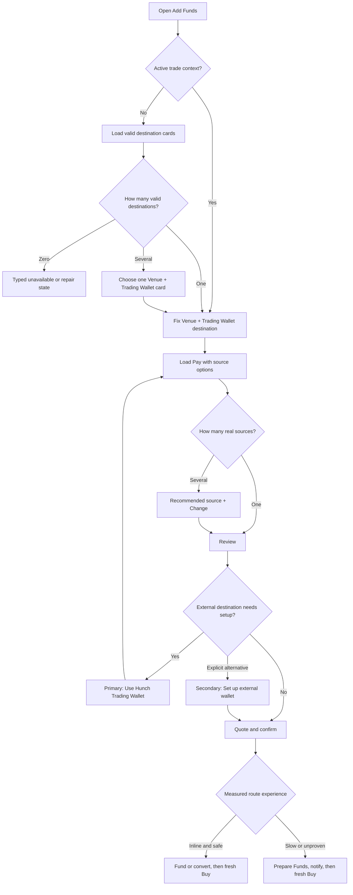
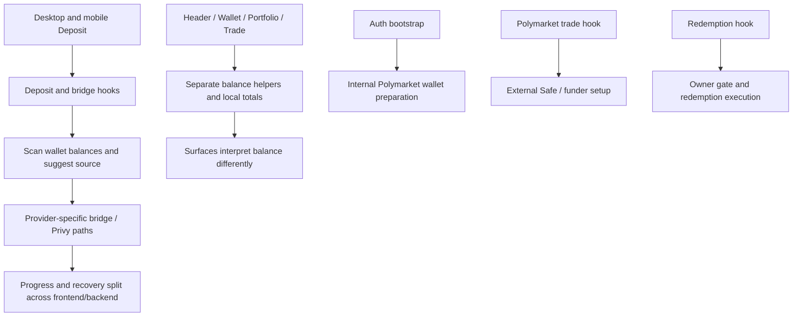
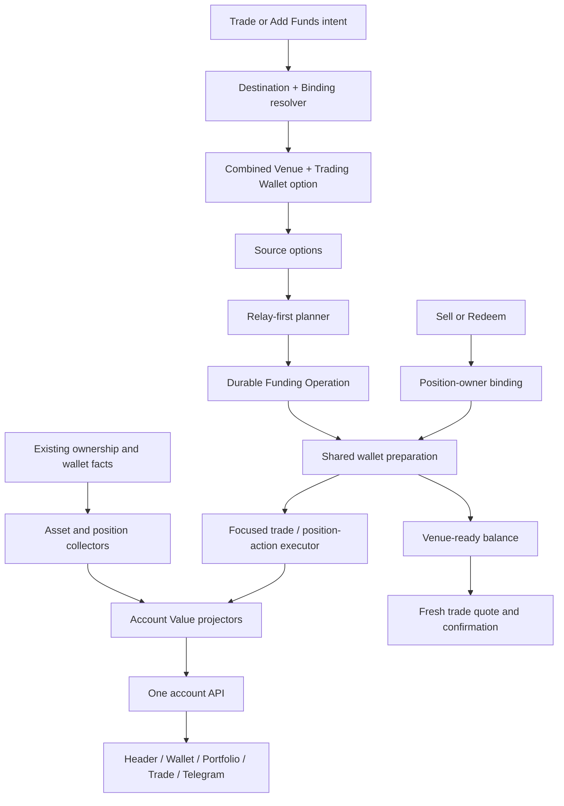

# Hunch Unified Account Value and Relay-First Funding Plan

Status: normative implementation plan, read-only research revision 2  
Scope: current Hunch frontend and backend; Polymarket and Limitless active; Kalshi/DFlow disabled; future venues represented only through contracts  
Primary new-route provider: Relay  
Legacy compatibility: Across and deBridge reconciliation, with new fallback routes disabled by default  
Supersession rule: this file does not modify or delete
`docs/unified-balance-plan.md`; when the two documents disagree, this revision
records the newer product and architecture decision

## 0. How to use this plan

This document is a dependency-ordered implementation specification, not a list
of independent tickets. A work package may start only after the contracts and
completion evidence of its dependencies are frozen.

The plan separates five facts that must never be collapsed:

1. what assets Hunch can prove belong to the user;
2. what those assets are approximately worth;
3. what amount can fund one concrete trade now;
4. what conversion or movement can make more amount executable;
5. where newly deposited or already placed liquidity should go.

Repository facts, provider facts, and product decisions have different evidence:

- **repository fact**: proven by current source, schema, tests, or branch history;
- **provider fact**: pinned to an official schema/document revision and sanitized fixture;
- **product decision**: explicitly defined in this document and enforced by tests;
- **operational fact**: proven only by configured capability checks and bounded
  rehearsal before activation.

No provider documentation is treated as proof that a route is live, economical,
or enabled for the Hunch account. Every executable route needs a pinned fixture,
local contract test, configured policy entry, and tiny-value activation evidence.

## 1. Executive decision

Hunch exposes one simple account headline while retaining exact internal
location and execution semantics:

```text
owned and supported cash/tokens
  -> one estimated Account Value

selected market + amount + venue binding
  -> Intent Liquidity
     -> available now
     -> available after fast conversion/funding
     -> prepare first
     -> unavailable

confirmed funding intent
  -> Placement Policy
  -> Relay-first Route Planner
  -> venue settlement location
  -> optional Hunch-owned venue preparation
```

Normative decisions:

1. The backend always returns liquid assets, prediction positions, and total
   portfolio value as separate estimates. A configurable presentation mode
   chooses whether the headline shows liquid assets only or liquid assets plus
   positions. That display choice never changes funding or trading eligibility.
2. Open prediction positions remain a separate portfolio component even when
   included in the headline. They are never treated as cash, convertible value,
   or immediately executable liquidity merely because the headline includes them.
3. Intent Liquidity is computed for one market, side, amount, venue-account
   binding, and execution profile. It is the only value used to enable Buy.
4. New capital and already placed capital use different placement rules:
   - an explicit Add Funds operation routes the full amount actually deposited;
   - a trade shortfall moves only the shortfall plus a bounded disclosed buffer;
   - a token conversion uses only the confirmed input or an exact-output max input;
   - no autonomous rebalance exists.
5. Generic Add Funds resolves valid venue/network/collateral/Trading Wallet
   destination combinations. With no active trade and more than one real
   destination, the user chooses one and Hunch marks a configurable recommendation;
   a recommendation is never implicit consent. Hunch never parks capital on Base
   or another canonical holding network.
6. Relay is the primary adapter for every new route that passes exact route,
   action, refund, economics, and policy validation.
7. Relay Deposit Addresses are a first-class plan shape for supported exchange,
   on-ramp, and manual-transfer ingress. They are activation-gated, not omitted
   from the architecture.
8. Across and deBridge do not define the new abstraction. Their old operations
   remain reconcilable through narrow versioned compatibility code. Any new
   fallback is exact-route, explicitly enabled, and off by default.
9. Privy remains the existing wallet, funding-presentation, delegated-action,
   and sponsorship capability. It is not a routing planner or settlement proof.
10. Web and Telegram consume the same backend quote, operation, reconciliation,
    and venue-readiness contracts.
11. Disabled Kalshi/DFlow contributes no balance, destination, routing,
    readiness, or delegated execution capability.
12. Hyperliquid and other future venues add location, balance, readiness,
    destination, trade, and reconciliation adapters later. No Hyperliquid code
    is implemented by this plan.
13. The internal Hunch Trading Wallet is the default managed binding unless a
    position owner or an explicit current-intent user selection requires another
    binding. A larger external balance is never enough to switch silently.
14. Wallet preparation and position redemption are shared venue capabilities,
    not private branches inside Deposit, Buy, or Telegram flows.

## 2. Product contract

### 2.1 User-visible promise

A user can:

- see one approximate dollar value for supported assets Hunch can prove they own;
- open a breakdown by cash, tokens, venue, wallet, network, pending movement,
  unpriced assets, and freshness;
- select a market and immediately learn how much is usable now;
- learn whether additional value can be made usable inline or must be prepared;
- add new capital by choosing a human-readable trading destination only when
  more than one real destination exists, without choosing raw chain IDs,
  collateral contracts, or provider routes;
- allow a supported token to be suggested as a source without authorizing an
  automatic sale;
- recover or resume a funding operation from web or Telegram Activity;
- understand every required signature, expected time, fee, and minimum received
  amount before confirmation.

Normal product copy never exposes Relay, Across, deBridge, provider chain IDs,
raw calldata, venue deposit contracts, or internal settlement terminology.

### 2.2 Value projections and configurable headline

The backend owns four related but non-interchangeable projections.

#### Liquid Assets Estimate

`liquidAssetsEstimatedUsd` is a display estimate:

```text
unique observed eligible cash
+ unique observed eligible liquid tokens with fresh trusted prices
+ conservative value of an in-transit owned claim after its source debit
- no locks or reservations
- no double-counted source/destination representation
```

Locks and reservations do not destroy ownership, so they do not reduce total
estimated value. They reduce spendability.

An in-transit claim replaces the observed source asset only after an
authoritative source debit. It is replaced by destination value after the exact
destination event is observed. It is never counted at the source, in transit,
and at the destination simultaneously.

#### Cash Availability

Cash availability is exact stable collateral at owned/recognized locations,
less authoritative venue locks, submitted debits, and effective reservations.
It is useful for breakdowns but does not imply that cash at two incompatible
venue bindings can fund one order.

#### Intent Liquidity

Intent Liquidity is computed from:

- target market and venue;
- one backend-resolved venue-account binding;
- requested order amount and current market quote;
- immediately spendable target collateral;
- eligible source assets and locations;
- fresh route quotes after fees, slippage, gas/rent, and minimum output;
- exact signer, payer, sponsorship, approval, and venue-readiness requirements;
- measured route classification: inline, prepare first, or unavailable.

Only `availableNow` can enable an immediate order. Convertible value is never
presented as immediately available.

#### Prediction Positions and Portfolio Value

The backend separately returns:

```text
liquidAssetsEstimatedUsd
positionsEstimatedUsd
totalPortfolioEstimatedUsd = liquidAssetsEstimatedUsd + positionsEstimatedUsd
```

`positionsEstimatedUsd` is projected once on the backend from unique open
position components returned by small venue position-value capabilities. Each
component carries venue/binding/position identity, valuation method, `asOf`,
confidence, and completeness. Polymarket and Limitless may reuse their existing
position facts through thin adapters; frontend totals are not an input. A venue
without fresh trustworthy position value returns partial/unpriced components
rather than guessed value. Open orders are not positions, and their locked cash
must not be counted again as position value.

The headline presentation mode is:

```typescript
type HeadlineValueMode = "liquid_only" | "liquid_plus_positions";
```

`liquid_only` renders `Estimated assets`. `liquid_plus_positions` renders
`Portfolio value` and exposes the liquid/positions split. In the initial rollout
the mode is a typed runtime product setting, not a user-facing toggle. The team
may test both modes without changing APIs or accounting. It changes only label
and composition. Cash Availability, Intent Liquidity, order validation, route
planning, reservations, and wallet selection must not read it.

`Portfolio value` inherits partial/stale status from both liquid and position
components. Switching the headline mode never makes a stale position estimate
fresh and never changes the underlying component set.

### 2.3 Required fields and copy

Account-level UI:

- `Estimated assets` or `Portfolio value` — configurable headline derived from
  the separately returned projection fields;
- `Positions` — always separately visible when present, whether or not included
  in the headline;
- `Cash` — stable venue/wallet cash before intent-specific compatibility;
- `Tokens` — supported freshly priced liquid assets;
- `In transit` — estimated owned value, never available now;
- `Unpriced assets` — count and details, excluded from the headline;
- `Updated` — projection and per-component freshness.

Trade-level UI:

- `Available now`;
- `Can use after conversion`;
- `Amount to prepare`;
- `Expected time` as a range;
- `Expected fees` and `Minimum received`;
- required signatures or external transfer;
- one primary CTA: `Buy`, `Convert and buy`, `Prepare funds`, or `Add funds`.

The UI may show a source/venue/network breakdown after expansion. A destination
choice uses a venue and Trading Wallet label plus a short explanation; it never
asks a user to choose an arbitrary network or collateral independently of a
valid backend destination combination.

### 2.4 Asset eligibility for the headline

An observed asset contributes to `liquidAssetsEstimatedUsd` only when all are true:

1. ownership is proven through existing user-wallet, Privy, or venue binding facts;
2. network and asset identity are canonical exact identifiers;
3. the balance observation is fresh enough for its collector policy;
4. the asset is not classified as spam, spoofed metadata, or unsupported dust;
5. a trusted price is fresh and carries an accepted confidence class;
6. the same economic asset instance is not represented by another component.

Execution eligibility is separate. A priced token may remain in estimated value
while routes are temporarily unavailable. Its component then says `not currently
usable`, rather than disappearing from the headline.

An unpriced asset remains visible with `estimatedUsd: null`; it is never silently
valued at zero and never inflates the total.

### 2.5 Token section and consent

The Tokens section lists supported positive balances from linked external,
embedded, smart, and venue-controlled wallets after ownership and deduplication.

Per asset, the user may store only a suggestion preference:

```typescript
type FundingSuggestionPreference = "ask" | "suggest" | "never_suggest";
```

`suggest` means Hunch may offer the token when a shortfall exists. It never
means approval, allowance, delegation, or authorization to sell. Every
conversion still binds an explicit confirmation to source asset/location,
maximum input, expected/minimum output, destination, fees, slippage, actions,
and expiry.

The product does not support arbitrary illiquid tokens merely because a token
account exists. Discovery, valuation, transferability, and route eligibility
are separate gates.

### 2.6 Placement policy

Placement depends on capital context:

| Intent | Amount Hunch may move | Default destination |
| --- | --- | --- |
| `add_funds` | full amount explicitly confirmed and actually received | current trade destination; otherwise one valid destination or explicit user choice among valid combinations |
| `trade_shortfall` | exact shortfall plus disclosed bounded buffer | current trade venue |
| `convert_asset` | confirmed exact input or exact-output max input | current trade destination or explicit generic destination choice |
| `withdrawal` | exact confirmed withdrawal amount | validated user destination |
| `manual_rebalance` | exact confirmed amount | explicit destination; feature initially off |

If a user deposits 100 USD while viewing a 5 USD Polymarket trade, all 100 USD
of the new deposit goes to the selected Polymarket settlement path. The 5 USD
trade amount does not truncate an explicit Add Funds intent.

If 100 USD already sits on Limitless and Polymarket is short by 5 USD, only the
shortfall and a bounded route buffer may move. The planner never sweeps the
whole Limitless balance.

The destination decision is:

1. an active trade fixes its venue and compatible Trading Wallet binding;
2. an explicit opaque destination choice is honored after revalidation;
3. with no trade and exactly one valid destination, proceed directly;
4. with no trade and several valid destinations, require the user to choose;
5. mark a configured recommendation, initially Polymarket, without committing it.

Each destination option is an inseparable backend-owned combination of venue,
network, collateral, and venue-account binding. Product copy may say
`Polymarket · Hunch Trading Wallet`; the client cannot mix that venue with an
arbitrary chain, collateral, address, or wallet reference.

Preference changes never move existing money. No background rebalance worker,
target allocation, or automatic consolidation is implemented. A future
recommendation engine may only produce a user-confirmed `manual_rebalance`
intent using the same operation contracts.

### 2.7 Trading Wallet selection scope

Hunch distinguishes internal managed Trading Wallets from linked external
wallets. The deterministic precedence is:

1. the binding that owns an existing position for Sell or Redeem;
2. an explicit valid selection for the current intent;
3. the internal Hunch Trading Wallet;
4. other executable or setup-capable external alternatives shown for choice.

An external wallet is not selected because it has the largest observed balance.
The initial selection scope is deliberately `current_intent`. The first rollout
does not persist a session or per-venue Trading Wallet choice
and does not expose `Remember my Trading Wallet`. Every new intent resolves
again from position ownership, explicit current choice, and the internal-Hunch
default. Session/per-venue memory may be added later as a separate product
feature without changing opaque binding or committed-operation contracts. A
committed funding, trade, or redemption operation always freezes its binding.

### 2.8 Wallet readiness, setup, and owner-bound actions

A discovered external address or estimated balance is not automatically a
working Trading Wallet. Every binding is classified as one of:

```typescript
type TradingWalletReadinessClass =
  | "internal_managed"
  | "external_ready"
  | "external_setup_available"
  | "external_source_only"
  | "external_view_only";
```

`external_ready` requires a connected signer/controller, a supported wallet or
Safe threshold, a deployed and registered venue funding wallet where required,
credentials/approvals, and an exact supported execution path. Setup-capable
wallets may offer `Set up this external wallet`. Source-only wallets may fund
the internal Hunch Trading Wallet through an explicit signed operation but
cannot be presented as executable venue bindings.

For a new Buy or Add Funds intent, `Use Hunch Trading Wallet` is the primary
path. `Set up this external wallet` appears as a secondary alternative only
after the user explicitly opens or selects that external wallet. Funding from
the external source remains an explicit transfer/conversion and signature.
Hunch never silently pulls external assets or moves internal funds into an
external wallet. For Sell or Redeem, the position-owning binding is mandatory:
switching to the Hunch wallet cannot act on a position owned by an external Safe.

### 2.9 Approved initial UX decisions

The initial product behavior is now closed:

1. headline mode is runtime-controlled; no user toggle ships initially;
2. Trading Wallet choice applies only to the current intent; no remembered-wallet
   setting or preference persistence ships initially;
3. each Add Funds destination is one combined `Venue · Trading Wallet` card;
   network and collateral are secondary read-only details;
4. one valid destination skips the destination step; several valid destinations
   require an explicit card selection, with Polymarket visibly recommended;
5. the internal Hunch Trading Wallet is the primary path; external setup is a
   secondary path shown only after explicit external-wallet interest.

Normative Add Funds decision flow:



### 2.10 Route experience policy

The backend, not the UI, classifies a selected route:

- `instant`: target venue is already executable;
- `inline_funding`: measured destination-observed p95 is at most 45 seconds,
  success is at least the configured threshold, required actions fit the
  current surface, and the order price deadline remains safe;
- `prepare_first`: route is slow, speed is unknown, an external transfer or
  delayed provider is involved, or the market quote cannot safely survive;
- `unavailable`: hard policy, economics, wallet, action, refund, or route gate fails.

Prepare Funds reserves no market price and never auto-buys. When funds are ready,
Hunch notifies the user and requires a fresh market quote and Buy confirmation.

The 45-second value is an initial configurable upper bound for preserving a
single Buy flow, not a claim about Relay or a permanent product constant. A
route becomes inline only from route-key, amount-band, action-count, destination-
ready measurements and market-quote safety. Relay may qualify for some routes
and remain Prepare Funds for others. Rehearsal/production evidence may tighten
the threshold; unknown speed always remains Prepare Funds.

### 2.11 Cognitive-load journeys

#### Solana token trader

1. Opens a market and sees estimated assets plus `Available now`.
2. If short, Hunch suggests SOL, USDC, or an eligible supported token.
3. User chooses amount and sees net received, fee, ETA, and signature count.
4. Fast route: `Convert and buy`; slow route: `Prepare funds` and later `Buy`.

No destination chain, token address, or provider choice is required.

#### Exchange user with USDC

1. Opens Add Funds from web or Telegram handoff.
2. Chooses exchange/manual transfer and source network/asset only when necessary.
3. Hunch issues an exact owned Receive instruction or an activation-gated Relay
   Deposit Address instruction.
4. Backend observes and correlates the transfer; the user returns to Buy.

The plan never uses an exchange hot-wallet sender as the refund address.

#### Existing Polymarket trader

Owned Polymarket cash is immediately available for a compatible binding. A
Limitless trade uses existing Limitless cash first and prepares only its
shortfall. Hunch does not centralize all cash or route it through Base.

#### Ethereum USDT user

The asset may contribute to estimated value when owned and freshly priced. The
selected market shows whether an exact Relay route is available. Unknown or
slow routes use Prepare Funds. No UI promise is made from symbol matching alone.

#### Card/bank user

Hunch opens only the Privy funding method actually configured for the app and
the exact destination. Provider `submitted`, modal completion, or receipt of
bank instructions is progress, not settlement. Backend observation completes
the funding operation.

#### Telegram novice

The bot says the purchase amount, current available amount, and one next action.
Browser-required wallet, Privy, card, or exchange work opens an authenticated
one-time web handoff. The bot resumes only after backend-confirmed readiness and
asks for a fresh Buy confirmation.

## 3. Scope and non-goals

### 3.1 In scope

- one estimated account-value projection for supported cash and liquid tokens;
- exact cash, lock, reservation, pending, and freshness breakdowns;
- intent-specific executable liquidity for Polymarket and Limitless;
- supported-token discovery, valuation, suggestion preference, and explicit conversion;
- deterministic new-deposit placement and shortfall-only movement;
- Relay Quote v2, status, normalized actions, reconciliation, and deposit addresses;
- Privy funding presentation, wallet resolution, action policies, and sponsorship reuse;
- current EVM and Solana wallet execution paths without Kalshi/DFlow coupling;
- provider-neutral funding operations shared by web and Telegram;
- Prepare Funds, notification, recovery, and fresh Buy confirmation;
- Across/deBridge legacy operation compatibility;
- exact-route fallback hooks disabled by default;
- deterministic current-intent internal/external Trading Wallet selection
  without persistence or balance-driven silent switching;
- shared purpose-aware wallet preparation for funding, Buy, Sell, Redeem, and
  Withdrawal readiness;
- owner-bound Polymarket redemption parity through a focused position-action capability;
- runtime policy, admin activation, fixtures, metrics, and rollback;
- local and tiny-value route rehearsals before activation.

### 3.2 Explicitly out of scope

- connecting or trading Hyperliquid now;
- reactivating Kalshi/DFlow;
- native Bitcoin support;
- a universal token router for arbitrary or unpriced assets;
- automated portfolio allocation or background rebalancing;
- hidden Hunch custody or a central treasury wallet;
- generic arbitrary destination calldata or external hooks;
- a provider marketplace in the user UI;
- combining collateral from several venue-account bindings for one order;
- transferring position ownership between Trading Wallet bindings;
- introducing a new universal trading/position-operation state machine in this
  funding phase; existing Sell/Redemption intent, execution, marker, and history
  paths are preserved behind focused capabilities;
- automatic purchase after Prepare Funds;
- recreating wallet linking, embedded-wallet provisioning, KYC, or card UI;
- migrating active legacy operations in place to a different provider;
- using provider token catalogs as the account inventory;
- direct production activation without fixtures and bounded rehearsal.

## 4. Audited current-state constraints

The implementation must reuse, not duplicate, current truths:

- `users`, `user_wallets`, Privy profiles, and venue credentials remain the
  identity and ownership system;
- current auth already enumerates embedded, smart, and linked external EVM and
  Solana wallets;
- current frontend already exposes a Privy funding entry point;
- current wallet balance APIs and open-order collateral logic contain useful
  lock-aware venue facts;
- current bridge routes and frontend orchestration are provider-coupled and are
  compatibility inputs, not the new domain boundary;
- current Across code uses Swap API for some EVM paths and legacy suggested-fees
  behavior for non-EVM paths;
- current deBridge code contains materially different same-chain and cross-chain behavior;
- current Polymarket funding uses an owner-authenticated Funding Router path;
- current Limitless trade execution retains its existing safety gates;
- current Telegram trading already has durable intents and idempotency that
  should reference a separate Funding Operation rather than be replaced;
- current Solana sponsorship and transaction inspection contain reusable
  venue-neutral behavior but are coupled to disabled Kalshi/DFlow code in places;
- abandoned Hyperliquid prototypes prove that funding, bridge, class transfer,
  withdrawal, trading, and responsive UI orchestration must not be combined in
  one hook or service;
- desktop/mobile Deposit and balance surfaces contain duplication that must be
  removed through shared controllers and projections, not copied into a third flow.

### 4.1 Current flow shape

The current system has useful working pieces, but ownership of decisions is
split across surfaces and large hooks:



This does not mean every current component is discarded. Wallet discovery,
Privy presentation, network execution, Polymarket preparation, venue trade
guards, redemption validation, notifications, and legacy reconciliation are
preserved behind thin capabilities. The duplicated decision/orchestration code
is what exits.

### 4.2 Target flow shape



The target therefore has one owner for each decision while keeping venue,
network, provider, and execution details behind small capability boundaries.

## 5. External documentation decisions

### 5.1 Relay

The adapter is pinned to official Quote v2 and Status v3 schemas. It stores
provider request/quote references internally and exposes only normalized Hunch
plans. Supported route discovery enriches adapter health but never overwrites
Hunch network, ownership, asset, or signing policy.

Relay capabilities are independent flags:

```typescript
type RelayCapability =
  | "wallet_quote"
  | "deposit_address"
  | "gasless_execute"
  | "fee_subsidy"
  | "gas_topup";
```

Enabling wallet quotes does not enable deposit addresses, arbitrary
authorization lists, gasless execution, or subsidy.

Relay Deposit Address documentation distinguishes strict and open behavior and
requires request/deposit-address tracking, including child requests after a
requote. Official pages are not fully consistent about native versus ERC-20
eligibility, so each enabled asset/network/mode needs a pinned schema and live
fixture. Deposit addresses cannot be assumed to execute arbitrary destination
calldata; venue preparation remains a separate Hunch-owned step.

### 5.2 Privy

Privy funding is modeled as configured ingress/presentation capabilities:

```typescript
type PrivyFundingCapability =
  | "legacy_fund_wallet"
  | "fiat_onramp"
  | "bank_deposit";
```

The current legacy hook may remain until a product need justifies migration.
Modern fiat and bank methods are experimental/configuration-dependent and are
not advertised from SDK availability alone. Privy crypto deposit addresses are
not a dependency of this rollout.

An exact Privy action policy applies to the wallet action API actually used.
Privy-managed EIP-7702 sponsorship may be accepted only through its pinned,
action-validated execution profile. A provider-supplied Relay
`authorizationList` is not forwarded merely because Privy can use EIP-7702.

### 5.3 Across

Across `/suggested-fees` is legacy for new integrations. Existing stored
adapter versions continue to reconcile unchanged. Any future new-plan Across
fallback must use the current Swap API for an exact route proven by fixtures.
No new non-EVM route is created from the deprecated mode without a separately
pinned supported contract.

### 5.4 deBridge

deBridge same-chain swap and cross-chain DLN are distinct adapter capabilities.
Existing DLN operations retain status, cancellation, refund, and recovery
support. Cross-chain deBridge is closed for new plans. Same-chain swap may be
enabled later only as an exact-route fallback. Quote/action freshness is capped
to the provider's short submission requirement, and cancellation may produce a
user-visible `recovery_action_required` state rather than an assumed refund.

## 6. Architecture invariants

### 6.1 Ownership, valuation, and accounting

1. One economic asset instance is counted once even if discovered by several profiles.
2. Existing ownership facts are resolved; no second wallet/account registry is created.
3. Symbol, name, icon, and decimals are metadata, never asset identity.
4. Account Value, cash availability, and Intent Liquidity are separate projections.
5. A lock or reservation reduces availability, not ownership value.
6. A pending output is never executable.
7. After authoritative source debit, one conservative in-transit claim may
   replace the source value until destination/refund observation.
8. Source, in-transit claim, destination, and refund cannot be counted together.
9. Stale or unpriced components never masquerade as fresh zero-value components.
10. Price data is display evidence; route net output is execution evidence.
11. Every projection carries `asOf`, component freshness, errors, and completeness.
12. Venue bindings remain separate for execution even when values are summed for display.
13. Prediction positions remain a separate component; headline composition is
    configurable and never changes cash availability or Intent Liquidity.

### 6.2 Execution

1. Quotes have no side effects.
2. Commit is idempotent and freezes plan hash, policy, binding, destination,
   amounts, route segments, execution profile, and limits.
3. No provider, destination, wallet binding, or placement substitution occurs
   after approval, signature, external handoff start, or broadcast.
4. Possible broadcast plus timeout becomes `reconcile_required`, not `failed`.
5. Actual observed amounts, not quoted amounts, feed the next segment and projection.
6. Segment two cannot start before exact intermediate output observation.
7. A route contains one segment or exactly two ordered segments; no DAG or route search.
8. The frontend cannot supply provider, recipient, venue contract, refund address,
   arbitrary calldata, external call, hook, or intermediate location.
9. Every normalized action is validated against the committed plan before execution.
10. Sponsorship is decided per exact action after transaction inspection.
11. External client/modal success is never financial settlement.
12. Prepare Funds never submits a market order and always requires a later fresh quote.
13. Token suggestion preference never authorizes conversion.
14. Retry cannot duplicate a source transaction, approval, funding call, or order.
15. A recommendation is presentation metadata, not a committed destination,
    wallet selection, or source authorization.
16. An external wallet action always requires its supported user-controlled
    signature path; ownership or balance never grants managed execution.
17. Sell and Redeem use the position-owning binding and cannot switch wallets to
    bypass missing readiness.
18. Preferences changed after commit cannot mutate an operation snapshot.

### 6.3 Placement

1. Add Funds moves the full user-confirmed amount actually received.
2. Trade Shortfall moves only the shortfall plus an explicit bounded buffer.
3. Existing venue balances are never swept by preference or route optimization.
4. Destination recommendation is pure; an ambiguous no-context destination is
   selected by the user before quote and frozen at commit.
5. A preference change never moves existing funds.
6. No automatic rebalance or hidden minimum top-up amount exists.
7. If a small shortfall is uneconomical, the planner returns Prepare Funds,
   a larger optional explicit deposit suggestion, or unavailable; it does not
   silently increase the transfer.

### 6.4 Extensibility and KISS/DRY

1. Core code does not branch on Polymarket, Limitless, Relay, Across, deBridge,
   Base, Polygon, Solana, or a future chain ID.
2. Core types do not assume EVM addresses, ERC-20 identifiers, or wallet-shaped venues.
3. Adding a venue supplies small capabilities, policies, fixtures, and tests;
   it does not change Account Value or Funding Operation state machines.
4. Data ingestion, public visibility, balance, valuation, funding, trading,
   withdrawal, and delegated execution are independently gated.
5. One inventory pipeline, one valuation projector, one planner, one operation
   reducer, and one user-visible status mapping serve all surfaces.
6. Provider DTOs stop in provider folders.
7. Existing wallet linking, provisioning, funding UI, notification, order, and
   runtime-policy systems are wrapped thinly rather than copied.
8. Venue adapters are capability-sized; no giant adapter with optional methods.
9. Legacy bridge APIs receive no Relay, Tokens, Prepare Funds, or future-venue branches.
10. Wallet preparation is one purpose-aware venue capability reused by auth,
    funding, trading, redemption, and Telegram; it is not copied into each flow.
11. Redemption is a position action, not a bridge, withdrawal, or Funding Operation.

### 6.5 Security

1. Provider and Privy secrets remain server-side and are redacted from logs.
2. Wallet ownership never implies server signing, delegated authority, or sponsorship.
3. Every recipient/refund/intermediate location is backend-derived and allowlisted.
4. Webhooks verify exact raw bytes and pinned authentication/signature rules.
5. Unknown provider action, status, asset, mapping, or signature kind fails closed.
6. Funding and trading authorization are separate.
7. Admin policy publication is typed, immutable, audited, and permission-scoped.
8. Fixture/mock adapters cannot be registered in production.
9. Solana sponsorship validates fee payer, native transfers, token accounts,
   ATA creation/closure, rent destination, and sponsor caps.
10. Privy/EIP-7702 paths accept only exact locally understood actions and policy domains.

## 7. Domain model

### 7.1 Identifiers and money

```typescript
type AccountId = string;
type WalletId = string;
type NetworkId = string;
type AssetId = string;
type LocationId = string;
type VenueId = string;
type VenueBindingId = string;
type ProviderId = string;
type OperationId = string;
type RawAmount = string;

type AssetRef = {
  networkId: NetworkId;
  assetId: AssetId;
  decimals: number;
};

type Money = {
  asset: AssetRef;
  raw: RawAmount;
};

type UsdEstimate = {
  value: string;
  asOf: string;
  priceSource: string;
  confidence: "high" | "medium" | "low";
  policyId: string;
};
```

Raw amounts are validated integer strings and use bigint arithmetic. Decimal
formatting and JavaScript `number` never participate in accounting or execution.

### 7.2 Asset locations and capabilities

```typescript
type AssetLocation =
  | {
      kind: "wallet";
      locationId: LocationId;
      accountId: AccountId;
      walletId: WalletId;
      address: string;
      asset: AssetRef;
    }
  | {
      kind: "venue_account";
      locationId: LocationId;
      accountId: AccountId;
      venueId: VenueId;
      accountRef: string;
      controllerWalletId: WalletId | null;
      address: string | null;
      asset: AssetRef;
    }
  | {
      kind: "in_transit_claim";
      locationId: LocationId;
      accountId: AccountId;
      operationId: OperationId;
      asset: AssetRef;
    };

type LocationCapability =
  | "observe"
  | "value"
  | "execution_source"
  | "venue_settlement"
  | "intermediate"
  | "withdrawal_source";

type AssetLocationPolicy = {
  locationPatternId: string;
  capabilities: LocationCapability[];
  enabled: boolean;
  policyVersion: number;
};
```

Capabilities belong to exact location patterns, not to a global assumption that
a network is a source, destination, or intermediate network. A future protocol
subaccount can be a venue settlement location without pretending to be an EVM wallet.

### 7.3 Ownership, execution, and venue bindings

```typescript
type WalletExecutionProfile = {
  walletId: WalletId;
  networkId: NetworkId;
  address: string;
  source: "embedded" | "smart" | "external";
  signingModes: Array<"web_client" | "privy_delegated">;
  serverWalletRef: string | null;
  sponsorshipPolicyIds: string[];
};

type VenueAccountBinding = {
  bindingId: VenueBindingId;
  venueId: VenueId;
  controllerWalletId: WalletId;
  executionWalletId: WalletId;
  accountRef: string;
  settlementLocation: AssetLocation;
  signingMode: "web_client" | "privy_delegated";
};

type VenueBindingOption = {
  venueBindingOptionId: string;
  safeLabel: string;
  readinessClass: TradingWalletReadinessClass;
  preparationPurpose: PreparationPurpose;
  selectable: boolean;
  reasonCodes: string[];
};
```

When several bindings are possible, the backend returns opaque
`venueBindingOptionId` values with safe wallet labels. The client never sends a
raw wallet or account reference as its authority. Commit resolves the option ID
and freezes the binding snapshot. Discovery and valuation do not make a binding
selectable; the appropriate preparation/readiness capability does.

### 7.4 Inventory and valuation types

```typescript
type ObservedAsset = {
  componentId: string;
  location: AssetLocation;
  amount: Money;
  ownershipEvidenceId: string;
  observedAt: string;
  freshness: "fresh" | "stale" | "error";
  metadataRisk: "verified" | "unverified" | "spam";
};

type ValuedAssetComponent = {
  componentId: string;
  location: AssetLocation;
  amount: Money;
  category: "cash" | "token" | "in_transit";
  estimatedUsd: UsdEstimate | null;
  valuationEligibility: "included" | "unpriced" | "stale" | "excluded";
  executionEligibility: "unknown" | "eligible" | "temporarily_unavailable" | "ineligible";
  reasonCodes: string[];
};

type ValuedPositionComponent = {
  componentId: string;
  venueId: VenueId;
  venueBindingId: VenueBindingId;
  positionRef: string;
  estimatedUsd: UsdEstimate | null;
  valuationMethod: string;
  valuationEligibility: "included" | "unpriced" | "stale" | "excluded";
  reasonCodes: string[];
};

type AccountValueProjection = {
  accountId: AccountId;
  liquidAssetsEstimatedUsd: string;
  positionsEstimatedUsd: string;
  totalPortfolioEstimatedUsd: string;
  headlineMode: HeadlineValueMode;
  positionValuationCompleteness: "complete" | "partial" | "stale";
  cashEstimatedUsd: string;
  tokenEstimatedUsd: string;
  inTransitEstimatedUsd: string;
  valuationCompleteness: "complete" | "partial" | "stale";
  unpricedAssetCount: number;
  asOf: string;
  components: ValuedAssetComponent[];
  positionComponents: ValuedPositionComponent[];
};
```

### 7.5 Funding intent and Intent Liquidity

```typescript
type FundingPurpose =
  | "add_funds"
  | "trade_shortfall"
  | "convert_asset"
  | "withdrawal"
  | "manual_rebalance";

type FundingIntent = {
  accountId: AccountId;
  purpose: FundingPurpose;
  requestedDestinationAmount: Money | null;
  confirmedSourceAmount: Money | null;
  marketContextId: string | null;
  destinationOptionId: string | null;
  venueBindingOptionId: string | null;
  maxFeeUsd: string | null;
  maxSlippageBps: number | null;
  deadline: string | null;
};

type FundingDestinationOption = {
  destinationOptionId: string;
  venueId: VenueId;
  venueBindingOptionId: string;
  safeLabel: string;
  requiredAsset: AssetRef;
  networkLabel: string;
  readinessClass: TradingWalletReadinessClass;
  recommended: boolean;
  selectable: boolean;
  reasonCodes: string[];
};

type IntentLiquidityProjection = {
  venueId: VenueId;
  venueBindingOptionId: string;
  requestedUsd: string;
  availableNowUsd: string;
  shortfallUsd: string;
  convertibleUsd: string;
  mode: "instant" | "inline_funding" | "prepare_first" | "unavailable";
  eta: { minSeconds: number; maxSeconds: number } | null;
  requiredActions: ActionSummary[];
  reasonCodes: string[];
};
```

### 7.6 Placement decision

```typescript
type PlacementDecision = {
  mode:
    | "confirmed_deposit_amount"
    | "trade_shortfall_only"
    | "confirmed_conversion_amount"
    | "confirmed_withdrawal_amount"
    | "manual_rebalance";
  sourceAmount: Money;
  destinationRequirement: Money;
  targetVenueId: VenueId | null;
  targetLocation: AssetLocation;
  boundedBuffer: Money | null;
  reason: "explicit" | "current_trade" | "single_valid_option";
  policyVersion: number;
};
```

`PlacementPolicy` is a pure function of the intent, observed balances, target
requirement, preference evidence, and policy snapshot. It cannot execute,
reserve, quote a provider, or mutate preference.

`recommended` is not a Placement Decision reason. It is non-authoritative UI
metadata on a destination option until the user chooses that option.

### 7.7 Plan shapes

```typescript
type FundingExecutionPlan =
  | {
      kind: "wallet_route";
      segments: [ProviderSegment] | [ProviderSegment, ProviderSegment];
    }
  | {
      kind: "relay_deposit_address";
      segments: [RelayDepositAddressSegment];
      ingress: ExternalIngressInstruction;
    }
  | {
      kind: "direct_external_handoff";
      segments: [];
      ingress: ExternalIngressInstruction;
    }
  | {
      kind: "already_available";
      segments: [];
    };
```

A Relay Deposit Address is not a zero-provider handoff: Relay has already
created a routable request and must reconcile the deposit and child requests.
A direct Privy/manual Receive to an owned final location has zero provider segments.

### 7.8 Small capability ports

```typescript
interface WalletOwnershipResolver {
  resolve(accountId: AccountId): Promise<OwnershipGraph>;
}

interface AssetInventoryCollector {
  collect(input: InventoryInput): Promise<ObservedAsset[]>;
}

interface PriceAdapter {
  value(input: PriceRequest): Promise<UsdEstimate | null>;
}

interface PositionValueCollector {
  collect(input: PositionValueInput): Promise<ValuedPositionComponent[]>;
}

interface BalanceCollector {
  collect(input: VenueBalanceInput): Promise<VenueBalanceFacts>;
}

interface VenueAccountResolver {
  resolve(input: VenueBindingInput): Promise<VenueAccountBinding[]>;
}

interface FundingDestination {
  listOptions(input: DestinationOptionsInput): Promise<FundingDestinationOption[]>;
  resolve(input: DestinationInput): Promise<FundingRequirement>;
}

type PreparationPurpose = "fund" | "buy" | "sell" | "redeem" | "withdraw";

type PreparationStatus =
  | "ready"
  | "setup_required"
  | "user_action_required"
  | "unavailable";

interface WalletPreparationAdapter {
  inspect(input: PreparationInspectionInput): Promise<PreparationResult>;
  prepare(input: PreparationInput): Promise<NormalizedAction[]>;
}

interface TradingExecutor {
  quote(input: TradeQuoteInput): Promise<TradeQuote>;
  submit(input: TradeSubmitInput): Promise<TradeResult>;
}

interface PositionActionExecutor {
  inspect(input: PositionActionInspectionInput): Promise<PositionActionReadiness>;
  prepare(input: PositionActionInput): Promise<NormalizedAction[]>;
  reconcile(input: PositionActionReconcileInput): Promise<PositionActionResult>;
}

interface RoutingProviderAdapter {
  descriptor: ProviderDescriptor;
  checkEligibility(input: ProviderEligibilityInput): Promise<ProviderEligibility>;
  quote(input: ProviderQuoteInput): Promise<ProviderQuoteCandidate>;
  prepareActions(input: ProviderActionInput): Promise<NormalizedAction[]>;
  reconcile(input: ProviderReconcileInput): Promise<SegmentReconcileResult>;
}
```

## 8. Target backend boundaries

Target module ownership under `apps/api/src`:

```text
account-value/
  ownership-resolver.ts
  inventory-service.ts
  valuation-service.ts
  account-value-projector.ts
  position-value-projector.ts
  cash-availability-projector.ts
  price-adapters/

funding/
  domain/
  intent-liquidity-service.ts
  placement-policy.ts
  destination-resolver.ts
  source-options-service.ts
  planner.ts
  operation-service.ts
  operation-reconciler.ts
  reservation-service.ts
  observation-service.ts
  history-projector.ts
  action-validator.ts
  policies/

funding-providers/
  relay/
    client.ts
    schemas.ts
    mappings.ts
    quote-adapter.ts
    deposit-address-adapter.ts
    status.ts
    webhook.ts
    fixtures/
  across/
    swap-api-adapter.ts
    legacy-reconciler.ts
  debridge/
    same-chain-adapter.ts
    dln-legacy-reconciler.ts

wallet-execution/
  resolver.ts
  evm-executor.ts
  solana-executor.ts
  privy-policy-validator.ts
  sponsorship.ts

venue-capabilities/
  polymarket/
    position-value.ts
    wallet-preparation.ts
    position-actions.ts
  limitless/
    position-value.ts
  registry.ts

routes/
  account-value.ts
  funding.ts
  funding-webhooks.ts
```

These are ownership boundaries, not a requirement to create dozens of empty
files. A module is split only when it has an independent contract, provider DTO,
security boundary, or test fixture set.

Existing services are reused through thin ports. Legacy `bridge.ts`, bridge
schemas, frontend deposit API, and bridge recovery remain behind a compatibility
mode until no caller or non-terminal operation needs them. They do not import
the new Relay adapter or grow new branches.

## 9. Account inventory and valuation

### 9.1 Collection

`WalletOwnershipResolver` first resolves existing embedded, smart, external,
and venue controller relationships. Collectors then fetch positive balances for
configured exact assets and safely discover additional candidates.

Discovery does not imply inclusion. The pipeline is:

```text
ownership -> observation -> canonical identity -> metadata/risk classification
-> valuation eligibility -> price -> execution eligibility on demand
```

For EVM and Solana, batch/RPC work may be shared internally, but collector output
remains provider-neutral. A Relay or Across token catalog may help route
eligibility; it is never used as proof that the user owns an asset.

### 9.2 Deduplication

Canonical component identity is derived from:

- account;
- normalized economic owner/location;
- network;
- exact asset identifier;
- venue balance class where applicable.

Multiple Privy linked-account records or aliases merge into one component with
multiple evidence references. A venue balance backed by a wallet token must
declare whether it is the same balance or a distinct protocol claim. Ambiguity
fails closed from the total rather than double-counting.

### 9.3 Price policy

`ValuationService` accepts price adapters through a deterministic priority list.
Each adapter returns source, timestamp, confidence, and policy ID. A cached price
is usable only within asset-class freshness limits.

Relay token price and Across `priceUsd` may be secondary route-context evidence,
not the sole authoritative valuation source. An executable quote never rewrites
the account-value price cache.

Stablecoins use exact-contract policy:

- no symbol-based 1 USD assumption;
- configured canonical USDC/pUSD classes may use the stable policy while healthy;
- impairment is explicit and immediately changes valuation and route eligibility;
- no new automatic depeg oracle is required for the initial rollout.

### 9.4 In-transit value

Before source debit, value remains at the source. After authoritative debit:

- create one in-transit component tied to the Funding Operation;
- value it conservatively from actual debit, known fees, and minimum output;
- mark it unavailable;
- replace it with observed destination or refund value;
- retain reconciliation state if final ownership cannot yet be proven.

This prevents the headline from collapsing during a bridge without pretending
the value can fund a trade.

### 9.5 API

```text
GET /account/value
GET /account/assets
PATCH /account/assets/:componentId/funding-preference
```

`GET /account/value` returns the projection and summary components.
`GET /account/assets` supports expanded inventory, pagination, filtering, and
execution-eligibility hints. The preference endpoint accepts only opaque
component IDs and the suggestion enum; it grants no transaction authority.
The account response includes the effective headline mode and all three value
fields so a presentation experiment never changes accounting data.

### 9.6 Freshness and caching

- ownership/profile cache: short TTL plus invalidation after account changes;
- venue cash and locks: venue-specific low TTL;
- token balances: network-specific TTL and refresh budget;
- prices: asset-class TTL with stale state;
- Account Value: derived cache keyed by component revisions;
- Intent Liquidity: never reused beyond its quote/policy expiry.

Partial collector failure returns partial value with component errors. It never
relabels old data as fresh. Buy remains governed by fresh target and route facts.

## 10. Intent Liquidity and source options

### 10.1 Request

```text
POST /funding/liquidity
```

The request contains market context or an opaque destination option, purpose,
amount, optional opaque binding choice, and user limits. It never contains a
raw venue/network/collateral combination, provider, destination address, refund
address, intermediate network, or calldata.

### 10.2 Algorithm

1. Resolve destination context. An active trade fixes the compatible venue and
   binding; an opaque choice is revalidated; one valid no-context option may
   proceed directly; several valid no-context options return
   `destination_selection_required` with one recommendation.
2. Resolve the selected binding using position ownership, explicit/stored
   preference, then internal-Hunch default precedence.
3. Resolve exact collateral requirement and purpose-aware wallet readiness.
4. Read immediately spendable target collateral after locks/reservations.
5. Calculate the exact shortfall.
6. If no shortfall, return `instant` without routing.
7. Enumerate owned source components and configured ingress methods separately
   from the already selected destination.
8. Apply transferability, risk, wallet execution, native-gas, route, fee, and
   user-consent eligibility.
9. Apply Placement Policy to determine the permissible source/destination amount.
10. Ask Relay first for exact eligible candidates.
11. Classify route experience from measured route policy.
12. Return normalized source options and one recommended source; never return a
    provider menu.

### 10.3 Source options

Each `SourceOption` includes:

- opaque ID and safe label;
- source asset/location and maximum usable raw amount;
- estimated USD value for display;
- exact-input or exact-output behavior;
- expected/minimum destination output;
- all fees by asset plus USD estimates;
- ETA range and route experience;
- signatures/external actions required;
- gas/rent and sponsorship readiness;
- expiry, warnings, and typed unavailability reasons.

Ingress options are distinct from executable wallet sources:

- existing embedded/linked wallet asset;
- Privy configured funding method;
- exact manual Receive instruction;
- Relay Deposit Address instruction;
- existing venue cash eligible for explicit shortfall movement.

The UI vocabulary is deliberately two-dimensional:

- **Where to add** selects one backend-issued destination option;
- **Pay with** selects one source option for that destination.

When each side has one valid option, go directly to review. Show `Where to add`
only for multiple real destinations. Show the recommended `Pay with` plus
`Change` only for multiple real sources. Internal managed sources are preferred
for simplicity, but an external source may be offered with an explicit wallet
signature. A linked external balance is never auto-pulled.

### 10.4 Multiple venue bindings

For Sell or Redeem, use the binding that owns the position. For Buy/Add Funds,
use an explicit valid current-intent choice, otherwise the internal Hunch
binding. Backend may return other `external_ready` or
`external_setup_available` opaque choices, but never orders or selects them by
largest balance. Source-only/view-only wallets do not appear as Trading Wallet
choices.

The UI shows a user-recognizable wallet label only when the choice materially
changes ownership, signatures, setup, or execution. The first rollout persists
no wallet preference beyond the current intent. The binding selected by commit
is immutable.

No order combines balances across bindings. Account Value may sum them for display.

## 11. Destination and placement resolution

### 11.1 Destination registry

`FundingDestination` resolves a venue requirement from Hunch-owned configuration
and current venue readiness. The client never provides the address or collateral.

```typescript
type FundingRequirement = {
  venueId: VenueId;
  venueBindingId: VenueBindingId;
  settlementLocation: AssetLocation;
  requiredAsset: AssetRef;
  requiredRaw: RawAmount;
  preparation: "none" | "user_followup" | "server_followup";
  readinessEvidenceId: string;
};
```

Every registered destination has independent gates for:

- venue lifecycle enabled;
- balance collection;
- funding;
- trading;
- withdrawal;
- web execution;
- delegated Telegram execution.

An indexed or publicly visible venue is not thereby fundable or tradable.

### 11.2 Destination options and recommendation

`FundingDestination.listOptions` returns only valid inseparable combinations of
venue, binding, network, collateral, and readiness. Examples include
`Polymarket · Hunch Trading Wallet` on its configured Polygon collateral or
`Limitless · Hunch Trading Wallet` on its configured Base collateral. These are
labels over backend facts, not client-assembled choices.

For generic Add Funds without a trade:

1. no valid option returns a typed unavailable/repair response;
2. one valid option proceeds without a destination screen;
3. more than one valid option requires an opaque user choice;
4. policy marks one recommendation, initially Polymarket while active;
5. recent trading may later inform recommendation ranking, but never auto-commits
   a destination when a real choice exists.

The chosen destination is snapshotted in the quote and operation. A recommendation
change never moves existing balances and never mutates an active operation.

### 11.3 Buffer policy

Only `trade_shortfall` may add a route buffer. The buffer:

- is calculated from exact provider minimums, destination rounding, and known
  gas/rent requirements;
- is capped by absolute USD and percentage policy;
- appears separately in quote copy;
- never turns a shortfall into a venue-balance sweep;
- is released as normal destination cash when unused.

If the required buffer exceeds policy, the route is unavailable or Prepare
Funds offers a separately confirmed amount.

### 11.4 Economics

Default warnings and hard rejection use net destination value:

- warn when disclosed total cost exceeds the lower of 5 USD or 10% of output;
- reject when it exceeds the lower of 10 USD or 20% of output;
- allow admin policy to tighten but not silently loosen user-confirmed limits;
- never increase requested amount solely to pass a provider minimum.

## 12. Funding operations and persistence

### 12.1 Aggregate ownership

`FundingOperation` is the sole durable aggregate for new funding, conversion,
shortfall, external ingress, preparation, and withdrawal movement. A parent
trade intent references it; it does not duplicate its state machine.

The aggregate owns:

- account and purpose;
- placement decision and evidence;
- source and destination snapshots;
- selected venue binding and wallet execution profile;
- policy, quote, plan hash, limits, and consent;
- ordered provider segments;
- normalized user/server actions;
- observations, reservations, recovery, and completion outcome.

### 12.2 Tables

#### `funding_operations`

Minimum columns:

```text
id uuid primary key
account_id uuid not null
purpose text not null
status text not null
progress_stage text not null
experience_mode text not null
plan_kind text not null
idempotency_key text not null
plan_hash text not null
policy_version bigint not null
source_location_snapshot jsonb
destination_location_snapshot jsonb not null
venue_id text
venue_binding_snapshot jsonb
wallet_execution_snapshot jsonb
placement_snapshot jsonb not null
requested_source_amount jsonb
requested_destination_amount jsonb
actual_source_amount jsonb
actual_destination_amount jsonb
quote_snapshot jsonb not null
consent_snapshot jsonb not null
parent_trade_intent_id uuid
error_code text
support_metadata jsonb not null
created_at timestamptz not null
updated_at timestamptz not null
completed_at timestamptz
```

Unique `(account_id, idempotency_key)` prevents duplicate commit. `plan_hash`
binds ordered segments, amounts, locations, actions, execution profile, binding,
limits, and policy.

#### `funding_operation_segments`

```text
id uuid primary key
operation_id uuid not null
ordinal smallint not null
provider_id text not null
adapter_version integer not null
segment_kind text not null
status text not null
source_location_snapshot jsonb not null
destination_location_snapshot jsonb not null
quoted_input jsonb not null
quoted_expected_output jsonb not null
quoted_min_output jsonb not null
actual_input jsonb
actual_output jsonb
provider_quote_ref_encrypted text
provider_request_ref_encrypted text
deposit_address_encrypted text
refund_location_snapshot jsonb
quote_expires_at timestamptz not null
submitted_at timestamptz
settled_at timestamptz
raw_status text
support_metadata jsonb not null
```

Constraints:

- ordinals are unique per operation and limited to 0 and 1;
- direct external handoff and already-available plans have zero segments;
- Relay Deposit Address plans have exactly one Relay segment;
- wallet route plans have one or two ordered segments;
- segment one source equals the exact observed segment-zero intermediate output;
- active stored adapter versions always have a reconciler.

#### `funding_operation_steps`

Stores normalized approvals, transactions, signatures, external handoff
instructions, server actions, and venue preparation. Each step has an immutable
fingerprint, executor, payer requirement, ordering dependencies, attempt state,
transaction/signature reference, and action-validation result.

No raw arbitrary provider action is executed from this table. Only a normalized
action that passed the common validator may become actionable.

#### `funding_observations`

```text
id uuid primary key
operation_id uuid not null
segment_id uuid
kind text not null
network_id text not null
asset_id text not null
tx_hash text not null
event_index text not null
from_address text
to_address text not null
raw_amount text not null
observed_at timestamptz not null
finalized_at timestamptz
metadata jsonb not null
```

Unique `(network_id, tx_hash, event_index, asset_id)` prevents one transfer from
settling several operations. Observations are allocated explicitly; raw account
balance delta is supporting evidence, not a durable correlation identifier.

For Relay Deposit Addresses, store deposit address, initial request ID, all
observed child request IDs, and exact received transfer. For a direct Receive to
a reused owned wallet, correlate the finalized transfer and operation amount/time
window; ambiguous concurrent transfers require transaction selection or support,
not arbitrary first-match allocation.

#### `balance_reservations`

Reservations identify owner, source component/location, asset/raw amount, mode,
expiry, and release/consume outcome. Required modes:

- `subtract_available`;
- `advisory_destination`;
- `settled_for_consumer`.

Reservation creation is in the same database transaction as operation commit.
Expiry does not release a source reservation until reconciliation proves no
transaction may have been broadcast.

#### `user_asset_funding_preferences`

Stores account, canonical asset/location selector, suggestion preference,
revision, and audit timestamps. It stores no approvals or permissions.

#### `funding_route_observations`

Stores redacted route key, provider/adapter version, amount band, timestamps,
actual latency stages, outcome, refund/recovery, and policy revision. It powers
experience classification and support, not accounting.

### 12.3 Operation and progress states

Use a small operation state plus an explicit progress stage.

```typescript
type FundingOperationStatus =
  | "awaiting_user"
  | "awaiting_external_funds"
  | "in_progress"
  | "ready"
  | "reconcile_required"
  | "recovery_required"
  | "completed"
  | "refunded"
  | "failed"
  | "cancelled";

type FundingProgressStage =
  | "committed"
  | "source_action"
  | "source_observed"
  | "routing"
  | "intermediate_observed"
  | "destination_observed"
  | "venue_preparation"
  | "ready_for_consumer"
  | "refunding"
  | "terminal";
```

`destination_observed` is therefore an explicit stage, not an undocumented
status. Valid `(status, stage)` combinations are declared in one transition map
and enforced by transition helpers and database integration tests.

Terminality rules:

- `ready` means funds are prepared for the parent trade and held by an advisory
  reservation; it is not an executed order;
- Add Funds or Convert may move from destination readiness to `completed` once
  no parent consumer is pending;
- a shortfall operation becomes `completed` when the parent trade consumes its
  settled reservation, or remains ordinary available cash when released;
- `recovery_required` is non-terminal;
- `refunded`, `failed`, `cancelled`, and `completed` are terminal only after
  reconciliation proves no additional value transition is pending.

### 12.4 Segment state

```typescript
type SegmentStatus =
  | "planned"
  | "awaiting_source"
  | "submitted"
  | "settling"
  | "succeeded"
  | "reconcile_required"
  | "recovery_required"
  | "refunding"
  | "refunded"
  | "failed";
```

Unknown provider status preserves raw status and maps to
`reconcile_required`. It never maps optimistically to failed, refunded, or success.

### 12.5 Commit, actions, and reconciliation

Commit performs one transaction:

1. verify quote ownership, expiry, policy, limits, binding option, and plan hash;
2. re-read source availability and destination readiness;
3. consume single-use consent/idempotency key;
4. insert operation, segments, steps, and reservation;
5. return safe actionable summary.

For every action:

1. reload committed operation;
2. verify expected step and dependency state;
3. prepare or fetch the normalized action;
4. validate exact chain, sender, recipient, selector/program, token, amount,
   approval, deadline, native value, refund, and payer policy;
5. persist attempt before handing off or broadcasting;
6. persist transaction/signature reference immediately;
7. reconcile instead of blind retry after ambiguity.

The reconciler uses provider status, chain observations, venue readiness, and
stored transaction references. Webhooks enqueue the same idempotent reconcile
path used by polling.

### 12.6 Retention

All new market, operation, reservation, notification, and history references
must be added to market-retention protected-reference, derived/delete-report,
cleanup, and hard-delete paths before retention deletion is enabled. Durable
financial rows and validated action fingerprints follow existing financial
retention. Logs contain only bounded redacted metadata.

## 13. Routing provider architecture

### 13.1 Normalized provider candidate

```typescript
type ProviderQuoteCandidate = {
  providerId: ProviderId;
  adapterVersion: number;
  capability: "same_network_swap" | "cross_network_transfer" | "cross_network_swap";
  amountMode: "exact_input" | "exact_output";
  source: AssetLocation;
  destination: AssetLocation;
  expectedOutput: Money;
  minimumOutput: Money;
  fees: ProviderFee[];
  eta: { minSeconds: number; maxSeconds: number };
  expiresAt: string;
  actionKinds: Array<"evm_transaction" | "svm_transaction" | "signature">;
  refundSemantics: RefundSemantics;
  opaqueQuoteRef: string;
};
```

Hard eligibility precedes any economics comparison. Reject candidates with an
unknown asset/location mapping, unsupported signer/action, unsafe refund,
unavailable native gas, disallowed calldata, expired quote, excessive fee,
insufficient output, or unproven route.

### 13.2 Relay wallet quote adapter

Relay Quote v2 integration must pin:

- request and response schemas;
- exact source/destination chain and currency mappings;
- exact-input/output behavior used by Hunch;
- expected and minimum output;
- transaction, approval, and signature item shapes;
- `requestId`, expiry, fee, refund, gas-topup, and subsidy fields;
- all status/error/rate-limit responses used by reconciliation.

Provider `topupGas`, `subsidizeFees`, `depositFeePayer`, gasless execution, and
authorization lists are individually disabled until their exact action and
economic semantics are implemented and tested. An accepted quote does not make
every returned executable item valid; the common action validator remains final.

### 13.3 Relay Deposit Address adapter

Use this plan only when the exact source network/asset, destination, mode,
refund location, limits, and request tracking pass activation evidence.

Initial recommended scope:

- exchange/manual/on-ramp ingress in a supported stable asset;
- open/variable amount when provider or exchange fees make exact receipt uncertain;
- a fresh unique operation/order identity;
- a verified user-owned embedded/linked refund location on the source network;
- direct settlement to the selected destination path;
- no arbitrary destination call;
- no reuse as a generic permanent deposit address in v1.

Strict mode may be enabled later for exact known input. Underpayment, overpayment,
wrong token, wrong chain, expiration, refund, and child requote behavior require
fixtures and explicit UI/support handling.

Lifecycle:

1. quote with deposit-address capability and safe `refundTo`;
2. commit operation and persist request ID/address before showing it;
3. show exact asset/network, amount semantics, expiry, and warning;
4. observe source transfer to deposit address;
5. query by request ID and deposit address, collecting child request IDs;
6. reconcile Relay settlement/refund;
7. observe final owned destination;
8. run separate venue preparation when required.

A Privy on-ramp may target the deposit address only when its installed/configured
API supports the exact address/asset/network and policy explicitly permits this
composition. Privy UI completion still does not settle the Relay segment.

### 13.4 Relay status and webhooks

The adapter stores raw status and normalizes through an exhaustive versioned map.
Official documentation inconsistencies such as `refund` versus `refunded`, or a
documented state missing from an enum, are handled by pinned fixtures and
unknown-status fail-closed behavior.

Webhooks:

- use a dedicated non-cookie route;
- verify the exact documented authentication/signature over raw bytes;
- persist provider event ID or deterministic fingerprint;
- enqueue reconciliation;
- never directly mutate terminal state from unverified payload data;
- fall back to bounded polling until terminal chain/destination evidence exists.

### 13.5 Across compatibility and fallback

Split current behavior into:

- `AcrossLegacyReconciler`: all stored adapter versions, including historical
  suggested-fees/non-EVM modes;
- `AcrossSwapApiAdapter`: possible new exact-route fallback using current Swap API.

Defaults:

- all new-plan Across route allowlists are empty;
- deprecated suggested-fees modes never create new operations;
- a fallback route must pin approvals, transaction, fees, expected/min output,
  quote expiry, refund behavior, balance/allowance checks, and status latency;
- unknown or slow routes classify as Prepare Funds;
- no provider switch occurs after commitment.

### 13.6 deBridge compatibility and fallback

Split current behavior into:

- `DeBridgeDlnLegacyReconciler` for existing cross-chain orders;
- `DeBridgeSameChainAdapter` for an optional exact-route swap fallback.

Defaults:

- cross-chain DLN creates no new operations;
- same-chain allowlist is empty;
- quote/action validity is no longer than the provider submission requirement;
- arbitrary `externalCall` and `dlnHook` are rejected;
- cancellation or recovery requiring user gas becomes `recovery_required`;
- same-chain transaction tracking does not pretend to be a DLN order.

### 13.7 Selection policy

For each permitted one- or two-segment shape:

1. evaluate hard Hunch eligibility;
2. ask Relay within a configured deadline;
3. select Relay if valid;
4. only if Relay has no eligible candidate, ask at most one exact-route fallback
   explicitly named by active policy;
5. return one normalized Hunch quote;
6. collect other provider comparisons asynchronously as non-executable shadow data.

There is no hedged winner race, scored provider optimizer, recursive route
search, or provider menu. Route health changes after commit affect only
reconciliation, never substitution.

### 13.8 Two-segment routes

A two-segment route is allowed only when:

- a single valid Relay route is unavailable;
- policy names the complete route shape;
- the intermediate is an exact allowlisted owned stable location;
- the first actual output can be observed and reserved;
- the second source equals that observation;
- total economics and ETA pass user limits;
- both adapters/actions pass their independent gates.

The planner supports at most two ordered segments. It does not build a graph.

## 14. Privy, wallet execution, and sponsorship

### 14.1 Reuse boundaries

Reuse existing:

- linked and embedded wallet enumeration;
- EVM and Solana embedded wallet provisioning;
- current `useDepositFundWallet` entry point;
- Privy server wallet references and policies;
- existing action-specific sponsorship mechanisms.

Add resolvers and thin presentation adapters. Do not create another AuthProvider,
wallet linker, wallet database, or generic wallet mega-adapter.

### 14.2 Funding method capability

Privy method eligibility is the intersection of:

- locally installed SDK/API support;
- dashboard/environment configuration explicitly recorded by Hunch;
- user/session eligibility;
- exact destination address, network, and asset support;
- destination observation support;
- runtime funding policy.

There is no assumed generic runtime API that proves every dashboard method.
The active method matrix is explicit configuration plus rehearsal evidence.

Method result semantics:

- modal open/close: presentation only;
- `submitted`: pending external process;
- bank instructions returned: awaiting external funds;
- provider `confirmed`: useful progress evidence, still followed by on-chain
  destination verification for Hunch accounting and readiness.

### 14.3 Execution profiles

External wallets remain client-signed. An address discovered through Privy does
not imply a wallet ID usable by server actions. `WalletExecutionResolver` must
return the exact profile for network and action class before quote.

Every normalized action records:

- signer/controller;
- execution wallet;
- user, Privy, or provider payer;
- required user and sponsor native amounts;
- policy ID;
- action class and validation rule.

External actions always resolve to `web_client` or another exact user-controlled
signing mode. The resolver cannot promote them to managed execution because an
address is linked, owns funds, or once completed venue setup.

### 14.4 EVM sponsorship and EIP-7702

Privy-managed EIP-7702 may be used only inside the exact Privy sponsorship path
whose transaction, policy, chain ID, typed-data domain, spender/recipient,
selector, amounts, deadline, and native value are understood locally.

A Relay quote containing `authorizationList` is rejected unless Hunch later
implements that exact Relay capability as a separate pinned policy. Privy
technology support is not authorization to forward provider-supplied delegation.

### 14.5 Solana execution

Extract only venue-neutral behavior from existing Solana code:

- transaction decode and program allowlist;
- signer and fee-payer validation;
- compute/fee/rent readiness;
- SPL token source/destination and authority checks;
- ATA creation/closure and rent-recipient checks;
- sponsor balance/cap checks;
- submission and confirmation.

The new boundary imports no Kalshi/DFlow service. Sponsoring an ATA that can be
closed for rent to an unintended recipient fails validation.

## 15. Venue capabilities

### 15.1 Polymarket

Polymarket registers independently:

- balance and lock collector;
- controller/funder binding resolver;
- collateral destination;
- one purpose-aware wallet-preparation adapter for Fund, Buy, Sell, Redeem, and Withdraw;
- position-action executor for redemption;
- trade executor;
- reconciler;
- web and delegated-policy capabilities.

Baseline funding path:

1. deliver approved Polygon USDC.e to the canonical user Deposit Wallet;
2. observe actual receipt;
3. invoke the existing owner-authenticated Funding Router path through the
   resolved Privy/user execution profile;
4. verify pUSD/CLOB-visible readiness;
5. expose funds for a fresh trade.

Direct pUSD is disabled unless an exact Relay route passes pinned quote/action,
settlement, ownership, and CLOB-visibility evidence. Relay destination calldata
must not call the current router under an incompatible `msg.sender` assumption.

The Polymarket preparation adapter becomes the single owner of the logic now
spread across auth bootstrap, Deposit/Buy orchestration, Safe deployment,
credential registration, approvals, and redemption readiness. It returns
`ready | setup_required | user_action_required | unavailable` for an exact
binding and purpose. Auth may proactively invoke it for internal managed wallets;
Add Funds, Buy, Sell, Redeem, and Telegram inspect the same capability rather
than reimplementing it.

An external binding is `external_ready` only when its controller can sign, its
Safe/deposit wallet shape and threshold are supported, required deployment and
registration are complete, and purpose-specific credentials/approvals are valid.
If setup is supported, the user may choose setup or switch a new Buy/Add Funds
intent to the internal Hunch Trading Wallet. A linked address with no executable
path remains source-only or view-only.

Redemption is a separate owner-bound position action. It reuses binding
resolution, wallet preparation, normalized action validation, EVM execution,
observation, reconciliation, and Activity, but it does not create a
`FundingOperation` and is not modeled as Withdrawal. A position owned by an
external Safe must be redeemed through that binding; setup/repair may be offered,
but switching to an internal wallet is not a valid redemption solution.

This phase does not invent a second generic durable aggregate for redemption.
The focused executor wraps the current web redemption marker/sync path and the
existing durable Telegram trade-intent action where applicable. A broader
trading-operation redesign requires its own parity and migration plan later.

### 15.2 Limitless

Limitless registers its existing owned Base collateral location, balance/locks,
wallet binding, readiness, and execution service. Existing Limitless cash is
used before any shortfall movement.

Its historically slow route classes remain `prepare_first` until route-specific
observations satisfy inline thresholds. Telegram Limitless trading remains off
while its existing order path lacks the required enforceable price/slippage
guard; funding capability does not bypass trading policy.

### 15.3 Future venues

A future venue supplies:

- canonical account/balance-class locations;
- ownership/controller binding;
- valuation and spendability semantics;
- locks/holds and freshness;
- funding destination and purpose-aware wallet preparation;
- wallet/signature/action policy;
- trade/position-action/withdraw/reconcile capabilities as actually supported;
- independent runtime gates.

Hyperliquid is a stress-test example because spot USDC, perps equity,
withdrawable value, class transfer, and chain/protocol actions differ. This plan
does not register Hyperliquid networks, balances, routes, policies, or UI.

### 15.4 Disabled venues

Kalshi/DFlow is omitted from active registries. Disabled historical collectors,
wallets, assets, or credentials cannot contribute Account Value through a venue
component, destination selection, funding, or delegated execution. A token in a
user wallet may still appear as an ordinary supported wallet asset if it passes
venue-independent inventory and valuation policy.

## 16. Public API

### 16.1 Account APIs

```text
GET   /account/value
GET   /account/assets
PATCH /account/assets/:componentId/funding-preference
```

### 16.2 Funding APIs

```text
GET  /funding/destinations
POST /funding/liquidity
POST /funding/quotes
POST /funding/operations
GET  /funding/operations/:id
GET  /funding/operations
POST /funding/operations/:id/actions/:stepId/prepare
POST /funding/operations/:id/actions/:stepId/report
POST /funding/operations/:id/external-handoff-started
POST /funding/operations/:id/cancel
POST /funding/withdrawal-destinations
```

`GET /funding/destinations` returns valid opaque destination combinations and
one configurable recommendation for a no-trade Add Funds flow. It does not
return independently composable raw network, collateral, address, or binding IDs.

`POST /funding/quotes` returns one immutable normalized plan with source options,
placement, destination/binding option, actions, economics, ETA, expiry, and
consent summary. It never returns provider secrets or raw provider DTOs.

`POST /funding/operations` commits a quote with idempotency key and explicit
consent. Action endpoints never accept replacement recipient/calldata.

Existing/new position-action endpoints for Sell/Redeem use the same binding and
wallet-preparation contracts but remain outside `/funding/operations`. Their
request identifies the owned position and opaque binding; the backend derives
all contracts, actions, and owner requirements.

### 16.3 Webhooks

```text
POST /webhooks/funding/relay
```

Provider webhook routes are outside cookie auth, enforce provider-specific raw
body verification and replay protection, and only enqueue reconciliation.

### 16.4 History

Unified Activity projects Funding Operations, external ingress, conversion,
preparation, withdrawals, refunds, and recovery. It may show provider details in
authenticated support/admin views only. Normal history uses Hunch language.

### 16.5 Error contract

Use typed stable codes grouped by:

- ownership and binding;
- valuation and freshness;
- insufficient/locked/reserved balance;
- asset/route/action eligibility;
- native gas/sponsorship;
- fee/slippage/deadline;
- external handoff and observation;
- provider reconciliation/refund/recovery;
- venue readiness;
- policy disabled or changed.

Frontend copy maps codes centrally. Components do not parse provider messages.

## 17. Frontend architecture

### 17.1 Shared data hooks

```text
useAccountValue()
useAccountAssets()
useFundingDestinations()
useIntentLiquidity(intent)
useFundingQuote()
useFundingOperation(operationId)
```

One query key and response formatter own each projection. Header, wallet,
portfolio, desktop trade, mobile trade, Deposit, and Tokens consume them. No
surface recomputes totals by summing formatted strings or venue-specific hooks.

### 17.2 One funding controller

One reducer/controller handles:

```text
idle
-> choosing_destination_binding
-> choosing_source
-> quoting
-> reviewing
-> setting_up_wallet
-> committing
-> awaiting_user_action / awaiting_external_funds / in_progress
-> ready / recovery / terminal
```

Desktop and mobile are renderers over the same state and actions. The controller
does not know provider names and does not contain venue transaction construction.

Thin presentation boundaries:

- `PrivyFundingHandoff` opens the existing configured Privy method;
- `ReceiveInstruction` renders backend-issued asset/network/address details;
- `WalletActionExecutor` asks the active wallet to execute a normalized action;
- `OperationProgress` renders backend status and recovery actions.

### 17.3 Deposit simplification

Default Add Funds flow:

1. resolve valid destinations and sources;
2. if several destinations exist, ask `Where to add` with one combined
   `Venue · Trading Wallet` card per opaque option, visibly mark Polymarket as
   recommended, and require an explicit card selection; if one exists, skip this step;
3. show a recommended `Pay with` and `Change` only when several sources exist;
4. review destination/Trading Wallet label, expected receipt, fee, ETA,
   signatures/setup, and actions;
5. confirm and follow progress.

Advanced source/network details are expanded only for exchange/manual Receive or
when several real choices differ materially. Destination venue/Trading Wallet
can be changed through opaque valid options, but chain/collateral remains
backend-resolved.

The internal Hunch card is the primary path. External alternatives live under
`Change` or the expanded destination list. If the user explicitly selects a
setup-capable external Trading Wallet, show `Use Hunch Trading Wallet` as the
primary repair and `Set up this external wallet` as the secondary action. The
external wallet may still appear under `Pay with` and requires its explicit
signature. Source-only/view-only wallets never appear as destinations. If an
internal wallet already has spendable balance, suggest the Hunch path; never
move that balance silently into the external wallet.

Tokens are a section of the same source selector, not a separate orchestration
product. Suggestion preference is editable from Tokens but conversion always
returns through the common quote/review/operation flow.

### 17.4 Trade CTA

The trade panel renders only backend Intent Liquidity:

- `instant` -> Buy;
- `inline_funding` -> Convert/Fund and Buy with both confirmations/actions made clear;
- `prepare_first` -> Prepare Funds;
- `unavailable` -> Add Funds or typed repair copy.

The frontend never infers route speed from provider, source chain, or venue name.

### 17.5 Balance and Trading Wallet presentation

The value response always contains liquid assets, positions, and total portfolio.
The effective headline mode controls label/composition only and is selected by
runtime product policy. The first rollout exposes no user toggle.

Trading Wallet alternatives expose only real selectable current-intent bindings.
There is no remembered-wallet settings surface in the first rollout. A
source-only/view-only external address never becomes a Trading Wallet.

### 17.6 Recovery

Operation ID is durable in backend history and optionally cached for navigation
convenience. Browser storage is not the source of truth. On reload, web and
Telegram read the same operation, available next action, and reconciliation state.

## 18. Telegram architecture

Telegram reuses existing trade intents and references a Funding Operation ID.
It does not fork the planner, operation state machine, provider adapters,
valuation, placement, or status copy.

Bot flow:

1. receive market/side/amount intent;
2. request Intent Liquidity;
3. show available amount and one next action;
4. for delegated supported actions, issue the same normalized operation and
   exact Privy policy validation;
5. for external/browser-required work, create a one-time authenticated web handoff;
6. wait for backend `ready` notification;
7. fetch a fresh market quote;
8. request final Buy confirmation;
9. submit through the existing trade-intent executor.

The bot never pulls a linked external wallet, invents a signer, treats a token
suggestion as consent, or buys automatically after preparation. Per-operation
and daily caps, policy revocation, idempotency, and audit remain mandatory.

Internal managed bindings are the Telegram default. A stored external preference
is used only when the bot's exact execution capability supports that binding;
otherwise the bot offers the internal Hunch path or an authenticated web handoff.
It never silently ignores ownership for Sell/Redeem.

## 19. End-to-end workflows

### 19.1 New SOL deposit to Polymarket

1. User enters Add Funds 100 USD while viewing a 5 USD Polymarket trade.
2. Destination resolver fixes the active Polymarket binding and requirement.
3. Placement Policy chooses `confirmed_deposit_amount`, not 5 USD shortfall.
4. Relay quote converts/routes the confirmed SOL input to approved Polygon collateral.
5. User reviews full input, net output, fee, ETA, and actions.
6. Commit reserves only owned internal source components; an external source is
   not subtracted until its authoritative debit.
7. Execute and reconcile Relay.
8. After Polygon receipt, execute Polymarket Funding Router follow-up if required.
9. Observe venue readiness; complete Add Funds.
10. Approximately 95 USD remains ordinary Polymarket cash after a later 5 USD buy.

### 19.2 Polymarket shortfall funded from existing Limitless cash

1. Trade intent computes Polymarket available amount and exact shortfall.
2. Source options may include eligible withdrawable Limitless cash only if a
   supported withdrawal/movement capability exists.
3. Placement Policy selects `trade_shortfall_only` plus bounded buffer.
4. If route is slow or expensive, return Prepare Funds/unavailable.
5. Never move the full Limitless balance.
6. Destination readiness produces a settled-for-consumer reservation.
7. Fresh Buy confirmation consumes the reservation; abandonment releases it as
   ordinary Polymarket cash.

### 19.3 Supported token conversion

1. Inventory shows owned token and estimated value.
2. User selects it explicitly or accepts a suggestion.
3. Backend checks canonical identity, transferability, wallet execution, gas,
   price, route, and destination.
4. Quote binds exact input or exact-output max input and minimum receipt.
5. User confirms; preference alone is insufficient.
6. Execute one or at most two segments, using actual intermediate output.
7. In-transit value replaces debited source value until final observation.
8. Final cash becomes available at the selected venue.

### 19.4 Exchange or manual transfer

1. User selects exchange/manual source, exact source asset/network, and amount semantics.
2. Backend chooses direct owned Receive or Relay Deposit Address.
3. For Relay, commit and persist request/address/refund facts before display.
4. User sends only the instructed asset/network.
5. Backend records exact transfer observation; client report is progress only.
6. Relay tracks initial and child requests, final settlement, or refund.
7. Venue preparation completes separately.
8. Wrong asset/network remains a recovery/support case and is never coerced into success.

### 19.5 Privy card/on-ramp or bank deposit

1. Eligibility proves the exact configured Privy method and destination.
2. Backend commits a direct handoff or Relay Deposit Address plan.
3. Frontend opens Privy for the immutable destination.
4. `submitted`, modal close, or bank instructions retain awaiting state.
5. Provider progress may accelerate support but on-chain destination observation
   settles Hunch accounting.
6. User is notified when funds are actually ready.

### 19.6 Slow Limitless route

1. Intent Liquidity recognizes route key/amount band as Prepare Funds.
2. User confirms funding without a market order.
3. Operation reconciles for the actual observed duration.
4. Ready notification appears on web and Telegram.
5. User receives a fresh Limitless quote and confirms Buy.

### 19.7 Withdrawal

1. User submits destination asset/network/address.
2. Backend validates codec, ownership/confirmation policy, blocked contracts,
   route, and exact destination; returns an opaque destination ID.
3. Quote binds source, amount, fees, destination snapshot, and actions.
4. Commit reserves source cash and executes through the same operation aggregate.
5. Source debit, destination/refund, and recovery are observed exactly.

Withdrawal uses the same primitives but may remain rollout-gated independently
if it would delay the core Add Funds/trade-shortfall path.

### 19.8 Telegram novice

1. Bot presents `Buy 20 USD` and `Available now 0 USD`.
2. It offers `Add funds` without chain/provider vocabulary.
3. One-time web handoff presents configured Privy or Receive choices.
4. Backend operation progresses independently of the browser.
5. Bot notifies `20 USD ready` and asks for fresh Buy confirmation.

### 19.9 Generic Add Funds without a trade

1. Backend returns active destination combinations for supported venues and bindings.
2. If only one exists, the flow proceeds directly; otherwise the user chooses
   one combined `Venue · Trading Wallet` card under `Where to add`, with
   Polymarket initially marked recommended.
3. Backend resolves sources for the selected destination and shows `Pay with`
   only when several real choices exist.
4. Review freezes the opaque destination and binding together with source,
   amount, fees, ETA, signatures/setup, and minimum receipt.
5. Commit, observation, and venue preparation follow the common operation path.

### 19.10 External wallet alternative

1. A linked external address is classified before it appears as a Trading Wallet.
2. `external_ready` may be explicitly selected and requires the supported client signature.
3. The internal Hunch binding is the primary path. After explicit external
   selection, `external_setup_available` offers `Use Hunch Trading Wallet` as
   primary repair and external setup as the secondary alternative.
4. `external_source_only` may appear only under `Pay with`; funding the Hunch
   wallet is an explicit signed transfer/conversion.
5. `external_view_only` contributes eligible estimated value but is not actionable.
6. No balance comparison silently changes the selected Trading Wallet.

### 19.11 Polymarket redemption

1. Resolve the exact position owner and its Polymarket binding.
2. Inspect redemption-purpose wallet readiness through the shared preparation adapter.
3. If setup/repair is possible, present it for the same owner binding; otherwise
   return a typed unavailable/recovery state.
4. Prepare and validate canonical redemption actions through the focused
   position-action executor and existing network execution boundary.
5. Reconcile redemption and refresh position/cash projections and Activity.
6. Never switch to the internal Hunch wallet to redeem an externally owned position.

## 20. Failure and side-effect audit

| Condition | Required behavior | Forbidden behavior |
| --- | --- | --- |
| Price source stale | mark component stale/partial | show old price as current |
| Token unpriced | show `estimatedUsd: null` | count it as zero or guessed value |
| Provider unavailable | preserve Account Value; route unavailable | remove owned asset from headline |
| Source debit observed, destination pending | replace source with one in-transit estimate | drop value or count both |
| Ambiguous broadcast | reconcile required | retry/broadcast again |
| Quote expires before signature | re-quote and re-confirm changed economics | submit stale action |
| Relay unknown status | preserve raw status and reconcile | map optimistically to success/failure |
| Relay child requote | attach child request to same operation | create unrelated user operation |
| Deposit wrong asset/network | recovery/support state | pretend committed route settled |
| Deposit-address under/overpayment | apply pinned mode behavior and actual amount | assume requested amount arrived |
| Unsafe refund address | route unavailable | refund to exchange hot wallet |
| Privy modal closes | continue awaiting observation | mark funding complete |
| Privy says submitted | record progress | credit destination cash |
| Destination cash observed | run required venue preparation | mark venue executable prematurely |
| PM router caller mismatch | use owner-authenticated follow-up | pass unverified Relay destination call |
| Slow route | Prepare Funds | hold old market quote or auto-buy |
| Trade abandoned after preparation | release reservation as venue cash | bridge funds back automatically |
| Existing Limitless balance covers source | move only shortfall | sweep whole balance |
| Headline includes positions | change display label/composition only | use positions as executable liquidity |
| Multiple Add Funds destinations | require one combined Venue + Trading Wallet card choice and mark recommendation | separate arbitrary network/collateral choice or auto-commit |
| One destination and one source | go directly to review | show redundant selection screens |
| External wallet has larger balance | keep position/explicit/preference/internal precedence | silently switch Trading Wallet |
| External source selected | require supported user signature | server-pull linked assets |
| External wallet lacks venue setup | prefer Hunch wallet; show external setup after explicit interest | call it ready because address/balance exists |
| External binding owns position | prepare/redeem through that owner binding | switch to Hunch wallet for redemption |
| Preference changes | affect future intents only | mutate active operation or rebalance money |
| Across/deBridge new fallback disabled | do not query/create | silently use legacy provider |
| Legacy operation active | reconcile stored adapter version | migrate provider mid-flight |
| deBridge cancellation needs gas | recovery action required | claim automatic refund |
| Sponsorship policy revoked | fail closed with repair action | fall back to generic signer |
| Unknown action/calldata | reject and alert | forward provider payload |
| Duplicate webhook | idempotent reconcile | regress or duplicate operation |
| Browser/bot restarts | resume from backend operation | depend on local reducer state |
| Disabled venue | omit exact venue capabilities | infer readiness from indexed data |

## 21. Runtime policy and admin control

### 21.1 Policy shape

The immutable effective funding policy owns:

- master mode: `off`, `shadow`, `internal`, `cohort`, `on`;
- account-value asset/network observation and valuation entries;
- per-venue position-value capability and freshness policy;
- headline presentation mode; user override is disabled in the initial policy;
- exact location capability registry;
- venue lifecycle and independent balance/funding/trading/withdraw/delegated gates;
- generic Add Funds recommendation order;
- Trading Wallet selection scope, fixed to `current_intent` in the initial policy;
- placement buffers, fee/slippage/minimum/maximum limits;
- route experience thresholds and exact overrides;
- provider capability flags and exact route allowlists;
- Relay deposit-address modes and refund requirements;
- Privy configured funding-method/destination matrix;
- wallet action, sponsorship, and delegated-policy IDs;
- purpose-aware wallet preparation and position-action capability gates;
- two-segment route allowlists and intermediate locations;
- Telegram per-operation/daily caps;
- collector, price, quote, polling, and reservation TTLs.

Policy contains canonical Hunch IDs, never provider DTOs or arbitrary code.

### 21.2 Cross-field validation

Publication fails when any are true:

- an asset can be valued without a registered exact identifier and price policy;
- a venue position can enter portfolio value without identity, freshness,
  valuation method, and deduplication policy;
- a settlement/intermediate capability points to an unowned/unobservable location;
- a route is active without pinned fixtures, adapter registration, action
  validator, reconciler, refund semantics, and destination observation;
- a Relay Deposit Address route lacks a verified refund location rule, transfer
  observation, request/child-request tracking, or wrong-asset recovery policy;
- a Privy funding method is active without explicit local configuration and
  exact destination support;
- a provider capability is inferred from another capability;
- an inline route lacks sufficient measured route observations or an explicit
  temporary internal-only override;
- a two-segment route lacks exact intermediate ownership and observation;
- a venue funding flag is on while its lifecycle/readiness destination is off;
- delegated execution is on without exact Privy action policies and caps;
- disabled Kalshi/DFlow or future Hyperliquid entries enter active registries;
- a fallback names deprecated Across suggested-fees or deBridge cross-chain
  new-plan behavior;
- a policy permits automatic rebalance;
- headline presentation mode is referenced by executable-liquidity policy;
- an external binding is selectable without exact purpose readiness and signer path;
- a position action permits a binding other than its proved owner;
- a no-trade multi-destination flow can commit without an opaque user selection;
- the initial policy enables a user headline toggle or remembered Trading Wallet.

### 21.3 Admin UI

Add a dedicated funding/account-value section that reuses existing typed
runtime-policy draft/diff/confirm patterns. It shows:

- effective revision and actor;
- master mode;
- asset/location capabilities;
- active venues and destinations;
- Relay capabilities/routes;
- deposit-address routes and refund rules;
- legacy provider reconciliation health;
- exact fallback allowlists;
- Privy funding and sponsorship capabilities;
- route latency/economics evidence;
- policy validation errors;
- activation and rollback snapshots.

Normal operations cannot edit policy. Publication uses dedicated read/write
permissions and immutable audit rows.

### 21.4 Local simulation

A constructor-injected local simulator provides deterministic ownership,
balances, prices, quotes, actions, status, deposits, child requests, refunds,
venue readiness, and time. It cannot be selected by production policy or loaded
from a runtime module path.

## 22. Observability and support

### 22.1 Structured events

Required event families:

```text
account_value_projected
account_value_component_excluded
intent_liquidity_projected
placement_decided
funding_quote_created
funding_operation_committed
funding_action_prepared
funding_action_submitted
external_handoff_started
source_observed
intermediate_observed
destination_observed
venue_preparation_started
funding_ready
funding_reconcile_required
funding_recovery_required
funding_refund_observed
funding_completed
provider_status_unknown
provider_webhook_rejected
```

Every event includes operation/account-safe correlation, purpose, route key,
adapter version, amount band, policy revision, stage, and redacted reason codes.
It excludes API keys, raw provider payloads, full calldata, signatures, wallet
authorization material, and unnecessary addresses.

### 22.2 Metrics

Account value:

- collector freshness/error by collector and network;
- projection latency and cache hit rate;
- priced, unpriced, stale, spam-excluded, and deduplicated component counts;
- included/unpriced/stale/deduplicated position component counts by venue;
- value changes caused by observation, price, and in-transit transitions;
- duplicate-component prevention failures.

Funding:

- quote success/latency by route key, amount band, provider adapter version;
- Relay-first selection and exact rejection reasons;
- source-submit to source-observed, destination-observed, venue-ready p50/p95;
- predicted versus actual route duration;
- inline versus prepare-first success;
- expected/minimum/actual output and total cost;
- deposit-address start, funded, child-requote, wrong asset, expiry, refund, completion;
- Privy handoff start to actual observation;
- reconciliation, recovery, refund, unknown status, and webhook fallback rates;
- shortfall amount versus moved amount, detecting accidental over-placement;
- prepared funds later consumed versus released.

Product:

- Add Funds completion by source type;
- source selector and Token suggestion conversion;
- steps/signatures from intent to ready and ready to Buy;
- drop-off at review, external transfer, signature, and fresh Buy confirmation;
- web/Telegram handoff completion.

### 22.3 Alerts

Alert on:

- the same observation allocated twice;
- source plus in-transit/destination double-counting;
- duplicate position components or open-order cash counted as position value;
- stale values reported as complete;
- destination fill without matching operation;
- segment one action before intermediate observation;
- operation state regression or invalid status/stage pair;
- active adapter version lacking reconciler;
- provider status/action/schema unknown;
- deposit-address funds with unknown operation or unsafe refund metadata;
- Privy/client completion without destination evidence after threshold;
- actual movement materially above committed placement amount;
- disabled venue/provider route selected;
- sponsorship recipient, native value, rent destination, or policy mismatch;
- route classified inline while measured p95/success violates policy.

### 22.4 Support view

Authenticated support may inspect:

- normalized operation/segment timeline;
- safe source/destination labels;
- request/transaction fingerprints and explorer links;
- raw provider status string, adapter version, and policy revision;
- observations and allocation;
- pending user/server/recovery action;
- expected/minimum/actual amounts and fees;
- refund location and state;
- venue readiness evidence.

Support cannot edit financial state directly. Repair commands are separate,
audited, idempotent, and operation-specific.

## 23. Testing strategy

### 23.1 Domain and property tests

Inventory/value:

- duplicate wallet/profile evidence counts once;
- both headline modes read the same liquid/position components and neither
  changes cash availability, Intent Liquidity, or Buy eligibility;
- duplicate position representations count once and open-order locked cash is
  not added again as position value;
- stale/unpriced/partial position valuation propagates to Portfolio value;
- exact network+asset identity defeats symbol spoofing;
- unpriced/stale/spam assets never inflate total;
- locks/reservations reduce availability but not Account Value;
- source -> in transit -> destination/refund counts exactly one value component;
- partial collector failure produces partial projection;
- formatted decimals and JavaScript numbers never enter raw arithmetic.

Intent/placement:

- incompatible venue bindings are not summed for one order;
- no-trade Add Funds with multiple destinations requires an opaque choice;
- one valid destination skips selection and a recommendation never commits itself;
- Add Funds 100 with trade 5 routes 100 received, not 5;
- existing venue cash moves shortfall only;
- buffer never exceeds policy and is separately disclosed;
- preference affects only future destination selection;
- no code path emits automatic rebalance;
- suggested token still requires operation-specific consent;
- unavailable route does not reduce Account Value.

Wallet/binding/preparation:

- Sell/Redeem always resolves the position-owning binding;
- explicit valid binding beats internal default; internal default beats any
  unselected external wallet regardless of balance;
- `external_source_only` and `external_view_only` never become Trading Wallet options;
- external execution always requires the exact client/user signature path;
- preference changes after commit leave the frozen binding unchanged;
- one Polymarket preparation contract produces purpose-specific readiness for
  auth bootstrap, Add Funds, Buy, Sell, Redeem, and Telegram;
- external Safe threshold/deployment/registration/credential/approval mutations fail closed;
- redemption never creates a Funding Operation or routes through Withdrawal.

State machine:

- every valid transition and no invalid transition;
- every status/stage combination is declared;
- duplicate/out-of-order webhook is idempotent;
- possible broadcast never blind-retries;
- segment two waits for exact intermediate output;
- terminal state cannot regress;
- ready never implies market order.

### 23.2 Shared provider contract suite

Run the normalized adapter suite against Relay and any enabled fallback fixture:

- canonical mapping and raw-unit preservation;
- exact-input/output semantics;
- expected/min output and complete fees;
- expiry and user limits;
- approval/transaction/signature normalization;
- native gas and sponsorship compatibility;
- safe refund semantics;
- unknown fields tolerated only when non-executable;
- unknown executable action/status fails closed;
- reconciliation across delayed, success, refund, failure, and ambiguity;
- raw provider DTO never escapes adapter module.

Relay-specific fixtures:

- Quote v2 EVM and Solana enabled actions;
- every enabled chain/currency mapping;
- rate limit, timeout, delayed, success, refund/refunded variation, failure,
  unknown status, and webhook replay;
- deposit-address strict/open enabled mode;
- underpayment, overpayment, partial, expiry, wrong token/network, refund;
- request ID, deposit-address lookup, and child requote/request tracking;
- unsafe refund location rejection;
- destination without arbitrary provider calldata;
- gas top-up/subsidy/gasless/authorization capability rejected when disabled.

Across:

- all stored legacy adapter versions reconcile;
- no new suggested-fees plan;
- Swap API fallback stays off without exact route policy;
- current approvals, fee, output, expiry, refund, and status fixtures.

deBridge:

- DLN legacy tracking/cancel/refund/recovery;
- no new cross-chain plan;
- same-chain transaction modeled separately;
- short quote expiry;
- arbitrary external call/hook rejection.

### 23.3 Action-validator security suite

Reject mismatched:

- chain, sender, signer, wallet ID, execution profile;
- recipient, refund address, intermediate, venue contract;
- asset, amount, allowance, spender, selector/program, instruction accounts;
- deadline, quote/plan hash, policy revision;
- native value, payer, sponsorship cap;
- typed-data domain, EIP-7702 authorization source;
- Solana fee payer, ATA authority/closure, rent recipient;
- segment order and observed intermediate amount;
- client-supplied arbitrary calldata, Relay external call, deBridge hook.

Every positive fixture is exact; every single-field mutation fails.

### 23.4 Database integration tests

- quote commit is idempotent;
- reservation and operation commit are atomic;
- segment-count/plan-kind invariants hold;
- observation unique key prevents double allocation;
- concurrent Receive operations do not first-match the same transfer;
- child Relay request remains attached to parent segment;
- actual outputs propagate to projections and next segment;
- source reservation survives ambiguous expiry until reconciliation;
- in-transit claim lifecycle counts once;
- terminal/refund/recovery transitions are durable;
- stored adapter version selects the correct reconciler;
- retention selector protects all new market/user-visible references;
- migrations succeed clean and from representative pre-feature schema.

Cross-table invariants not expressible as simple checks are enforced by one
repository transaction boundary plus integration tests. Do not scatter them
across route handlers.

### 23.5 API and frontend tests

- account value and asset breakdown render complete/partial/stale correctly;
- Tokens suggestion preference never changes balance or executes;
- desktop/mobile/header/trade use shared projection and formatter;
- one reducer drives Deposit on both layouts;
- CTA maps only from backend experience mode;
- Privy modal result remains awaiting observation;
- Relay Deposit Address shows immutable exact instructions and expiry;
- provider names/raw DTOs do not appear in normal responses/components;
- Prepare Funds never starts Buy and always requotes;
- reload resumes from backend operation;
- multiple wallet bindings use opaque options and safe labels;
- destination and source selectors appear only for real choices;
- destination choice renders one opaque Venue + Trading Wallet card, never
  independent venue/network/collateral/wallet combinators;
- external setup versus internal-Hunch switch renders from typed readiness;
- Hunch Trading Wallet is the primary new-intent path; external setup appears
  only after explicit external-wallet interest;
- headline mode changes label/composition but never trade CTA;
- no initial user headline-toggle or remembered-wallet settings surface exists;
- error codes map through one copy registry;
- no responsive breakpoint class is relied on while repository breakpoints are disabled.

### 23.6 Telegram tests

- same quote/operation shape as web;
- one-time handoff authentication and replay prevention;
- external wallet is never server-pulled;
- token suggestion requires explicit quote confirmation;
- exact delegated policy/caps and revocation;
- ready notification never auto-buys;
- fresh market quote and Buy confirmation required;
- unsupported Limitless bot trading fails closed.
- unsupported external binding uses web handoff/internal alternative, never silent fallback;
- owner-bound redemption cannot switch to the bot's internal default.

### 23.7 Route matrix

At minimum:

| Source | Destination | Purpose/mode | Required evidence |
| --- | --- | --- | --- |
| existing PM collateral | Polymarket | instant trade | binding, locks, readiness |
| existing Limitless collateral | Limitless | instant trade | binding, locks, readiness |
| Solana SOL | Polymarket | Add Funds exact input | Relay, gas/rent, PM follow-up |
| Solana USDC | Polymarket | Add Funds | Relay route/settlement |
| Ethereum supported USDT/USDC | Polymarket | prepare/inline by evidence | exact mapping, refund, net output |
| supported wallet token | active venue | conversion | consent, price, route, min output |
| exchange stablecoin | active venue | Relay deposit address | observation, child request, refund |
| Privy configured on-ramp | exact destination | external handoff/deposit address | method config, observation |
| existing other-venue cash | target venue | shortfall only | withdrawal/movement capability |
| any enabled source | Limitless slow route | Prepare Funds | measured latency, fresh Buy |
| eligible cash | validated user destination | withdrawal | destination ID, recovery |
| external ready binding | active venue | explicit Trading Wallet | signer, setup, readiness |
| external source-only wallet | internal Hunch destination | explicit funding | client signature, observation |
| owned PM position | owner PM binding | redeem | owner proof, preparation, action validation |

Every proposed active route runs through Relay first. Across/deBridge matrix
rows exist only for legacy reconciliation or an explicit disabled-by-default
fallback test.

### 23.8 Chaos and recovery

- provider timeout before and after possible broadcast;
- webhook lost, duplicated, delayed, forged, or out of order;
- API/worker restart at every persisted stage;
- browser closes before/after signature or handoff;
- price and inventory collector partial outage;
- source reorg/finality delay;
- destination observed before provider status;
- Relay child request appears after initial request delay;
- refund arrives after a stale failure indication;
- runtime policy changes while operation is active;
- Relay set to drain/off with active segments;
- legacy reconciler retained while new-plan provider disabled;
- venue readiness becomes unavailable after destination receipt.

### 23.9 Lightweight test execution policy

Hunch is a small team and this plan does not introduce a mandatory test pipeline
on every pull request or every deployment. The normal deployment path must stay
close to the current five-minute duration and must not wait for live provider,
wallet, bridge, deposit, venue-settlement, or full end-to-end rehearsals.

Use three deliberate test modes:

1. **Focused local checks** — the developer runs the relevant unit, type, lint,
   fixture, or integration checks for the area being changed.
2. **Milestone verification** — the full local suite and route matrix run when a
   work package is completed, before the first broader rollout, or after a
   material change to shared funding/execution contracts.
3. **Manual live rehearsal** — tiny-value real operations run only before
   activating a new route/capability, after a material provider/action-policy
   change, or during targeted diagnosis. They are never part of the ordinary
   deploy command.

Fast deployments and financial verification are therefore independent:

```text
normal code deploy (~5 minutes)
  -> no live transfer or full route matrix

new route/capability activation
  -> previously completed manual rehearsal evidence
  -> policy activation only
```

The team may run a focused smoke check after deployment when the touched risk
justifies it, but this is a conscious operation, not a permanent CI/deploy gate.

## 24. KISS/DRY and change-boundary gates

### 24.1 Single owners

| Concern | Single owner |
| --- | --- |
| wallet/account ownership | `WalletOwnershipResolver` over existing truth |
| inventory | `InventoryService` |
| USD estimates | `ValuationService` + `AccountValueProjector` |
| position estimates | venue `PositionValueCollector` + `PositionValueProjector` |
| target spendability | `IntentLiquidityService` |
| placement amount/destination reason | pure `PlacementPolicy` |
| destination choices/recommendation | `FundingDestination` + runtime policy |
| Trading Wallet selection | `VenueAccountResolver` + binding-selection policy |
| wallet setup/readiness | purpose-aware `WalletPreparationAdapter` |
| redemption | focused `PositionActionExecutor` using owner binding |
| route/provider choice | backend `FundingPlanner` |
| durable progress | `FundingOperation` + reconciler |
| action security | normalized validator + network executor |
| venue collateral/readiness | small venue capabilities |
| UI orchestration | one funding controller |
| status copy | one response/copy mapper |

No second module may recompute these decisions for convenience.

### 24.2 Thin wrappers

Allowed thin wrappers:

- current Privy funding hook -> `PrivyFundingHandoff`;
- existing auth/user-wallet data -> ownership resolver;
- current PM/Limitless services -> focused readiness/trade/destination adapters;
- current Polymarket auth bootstrap, Safe/deposit-wallet setup, approvals, and
  redemption preparation -> one purpose-aware preparation adapter;
- existing EVM/Solana execution -> network executors;
- legacy bridge rows -> versioned legacy reconcilers;
- notification system -> funding-ready/refund/recovery notifier.

Wrappers may translate types and delegate. They may not own another reducer,
destination policy, provider fallback, balance sum, or retry state machine.

### 24.3 Duplication audit

Before implementation, run the deterministic code-duplication audit across:

- frontend Header/Wallet/Portfolio/EventSwap/Deposit desktop/mobile;
- frontend deposit/bridge hooks and API clients;
- backend bridge/provider/status/deposit-event services;
- PM/Limitless wallet readiness and trade execution;
- Telegram funding/trade intent flows.

Record clone classes and coverage as a baseline. At each relevant work package:

- no new clone class may copy operation, provider, balance, placement, or status logic;
- duplicated UI business logic must move to shared controller/selectors before
  adding the new feature branch;
- touched-surface duplicate coverage must not increase;
- any deliberate small duplication needs an explicit comment in the audit report
  explaining why abstraction would be less clear;
- final audit must identify removed clone classes and any remaining legacy-only clones.

Do not invent a universal framework merely to reduce line similarity. Shared
code must represent one real domain owner.

### 24.4 Anti-spaghetti rejection rules

Reject an implementation that:

- adds Relay to the old frontend BridgeProvider union;
- adds Tokens, Prepare Funds, or future venues to legacy bridge hooks;
- computes Account Value in React components;
- names provider or chain to decide UI speed/CTA;
- auto-selects an external wallet from its balance;
- treats a discovered external address as a ready Trading Wallet;
- copies Polymarket wallet setup into auth, funding, trade, redemption, and bot flows;
- models redemption as a bridge, withdrawal, or Funding Operation;
- lets provider catalogs define owned inventory;
- merges Account Value and executable balance into one numeric field;
- moves full existing venue balance for a shortfall;
- adds a rebalance worker or Base parking wallet;
- interprets suggestion preference as sell permission;
- forwards provider calldata/signatures without normalized validation;
- treats all Privy wallets as delegated/sponsored;
- imports API-wide required-secret config into sidecars;
- imports Kalshi/DFlow services into the new Solana executor;
- stores recovery only in browser local storage;
- branches core logic on venue/provider/chain IDs;
- implements a third desktop/mobile funding reducer;
- deletes legacy reconciliation before all active rows are terminal.

## 25. Mandatory implementation order

### Work package 0 — Freeze contracts and evidence

Required work:

- inventory every current balance, lock, wallet, Deposit, Convert, Bridge,
  Withdraw, PM/Limitless, Privy, Solana sponsorship, Telegram, admin policy,
  notification, retention, and recovery touchpoint;
- inventory internal/external Trading Wallet selection, Safe/deposit-wallet
  deployment/registration, auth bootstrap, approvals, position ownership,
  Sell, and Redemption touchpoints;
- record current branches and source/schema revisions without changing branches;
- run deterministic duplication baseline;
- freeze domain vocabulary and API examples from sections 2 and 7;
- freeze destination-versus-source, current-intent binding precedence,
  readiness classes, and purpose-aware preparation contracts;
- pin official Relay Quote/Status/Deposit Address/OpenAPI evidence and sanitized fixtures;
- pin actual configured Privy funding methods/destinations and action policies;
- capture every active legacy Across/deBridge adapter version and non-terminal row shape;
- define canonical assets, location capabilities, settlement destinations,
  intermediate allowlist, price policies, and route keys;
- capture route latency/economics evidence where available;
- map every requirement to a test/fixture/command owner.

Create three lightweight mandatory artifacts before implementation begins:

1. **Legacy Exit Matrix** — every old quote/create/UI/orchestration/provider
   component, whether it still has a live caller or stored operation, the exact
   replacement, the point at which new use stops, and the objective deletion
   condition. Old operation reconcilers are marked live compatibility, not dead
   code; old creation/UI code must have a physical removal milestone.
2. **Live Rehearsal Harness** — a manual, guarded tiny-value runner for exact
   scenarios such as Relay wallet routing, Relay Deposit Address funding,
   Polymarket/Limitless settlement visibility, Privy-sponsored actions, and
   withdrawal, plus external-wallet setup and owner-bound redemption where
   those capabilities are proposed for activation. It reads required keys only
   from local/secret environment,
   performs a read-only preflight by default, requires explicit live and
   maximum-spend confirmation, and writes a redacted run report. It is not
   invoked by ordinary deploys.
3. **Functional Parity Matrix** — every currently working user journey, its new
   path, required fixture/live evidence, rollout state, and the condition under
   which the corresponding legacy path may be removed. A route without proven
   replacement remains on its working legacy path or is subject to an explicit
   product decision; it does not disappear accidentally.

Completion evidence:

- all three artifacts exist, have named owners, and contain current rather than
  placeholder rows;
- no unknown active legacy adapter version;
- no external schema claim lacks source/revision/date;
- all current wallet/venue/signing facts have repository paths;
- product defaults and unsupported features have no placeholders.

### Work package 1 — Domain, policy, and fail-closed control plane

Required work:

- implement provider/venue-neutral types, location capabilities, funding intent,
  projections, plan union, normalized actions, reason codes, and transition map;
- implement opaque destination/binding options, readiness classifications,
  current-intent Trading Wallet selection, preparation purposes, and position-action ports;
- implement static registries and typed immutable runtime policy;
- implement cross-field validation and production fixture-adapter exclusion;
- add admin read/diff/confirm/publish surface and dedicated permissions;
- define action-validator and network-executor contracts;
- implement local simulator interfaces without registering them in production.

Completion evidence:

- core imports no provider DTO or venue implementation;
- invalid combinations from section 21 fail publication;
- master-off leaves current production behavior unchanged;
- future custom location type passes contract tests without core branch.

### Work package 2 — Ownership, inventory, valuation, and projections

Required work:

- implement ownership resolver over existing facts;
- implement inventory collectors and canonical deduplication;
- implement price adapter boundary, stable impairment policy, and freshness;
- implement Account Value, cash availability, and in-transit projection;
- return liquid assets, positions, and total portfolio separately with a
  display-only effective headline mode;
- implement thin Polymarket/Limitless position-value collectors, backend
  deduplication, and partial/stale position completeness;
- implement asset suggestion preferences;
- replace frontend-local totals with the new read API behind master mode;
- retain positions separately regardless of headline mode.

Completion evidence:

- all value/availability/deduplication property tests pass;
- header/wallet/portfolio/trade no longer compute conflicting totals;
- token value appears in estimated assets but never directly enables Buy;
- partial/stale/unpriced states render truthfully;
- toggling headline mode cannot change any liquidity, route, wallet, or CTA result;
- no frontend or venue hook independently recomputes the positions headline total.

### Work package 3 — Durable operations, observations, reservations, reconciliation

Required work:

- add operation/segment/step/observation/reservation/preference/route-observation schema;
- implement idempotent commit and transition helpers;
- implement exact transfer observation allocation and in-transit claims;
- implement polling queue, webhook enqueue boundary, restart-safe reconciliation;
- implement ready/consume/release relationship with parent trade intent;
- integrate retention protection and notifications;
- implement legacy adapter-version dispatch interfaces before provider migration.

Completion evidence:

- migrations and DB integration tests pass;
- no invalid state/stage pair or duplicate observation is possible through repositories;
- restart/ambiguous broadcast/refund simulations converge;
- old operation rows remain untouched and reconcilable.

### Work package 4 — Relay adapter and provider compatibility isolation

Required work:

- implement pinned Relay client, schemas, mappings, quote, normalized actions,
  status, polling, webhook verification, and reconciliation;
- implement Relay Deposit Address plan, observation, request/child-request, and refund handling;
- implement capability-specific rejection for gasless/subsidy/topup/authorization features;
- split Across legacy reconciler from optional Swap API adapter;
- split deBridge DLN legacy reconciler from optional same-chain adapter;
- run shared provider and action-validator suites;
- keep all new fallback allowlists empty.

Completion evidence:

- Relay DTOs remain inside Relay modules;
- every executable Relay shape has a fixture and negative mutation test;
- deposit-address partial/wrong/refund/child behavior is covered;
- all active legacy versions reconcile;
- no new Across suggested-fees or deBridge cross-chain operation can be created.

### Work package 5 — Destination, placement, Intent Liquidity, and planner

Required work:

- implement PM/Limitless binding and destination adapters;
- implement valid destination-option enumeration, configurable recommendation,
  deterministic Trading Wallet selection, and pure Placement Policy;
- implement cash spendability, shortfall, source options, route economics, and experience classification;
- implement Relay-first deterministic selection and bounded two-segment plans;
- implement quote storage, plan hash, consent, and public APIs;
- integrate actual route observations into policy classification.

Completion evidence:

- Add Funds 100 versus trade 5 and existing-cash shortfall cases pass exact tests;
- no Base parking or automatic rebalance path exists;
- UI input cannot choose provider/destination address;
- no-context multi-destination Add Funds cannot quote until the user chooses;
- external balance size never overrides position/explicit/preference/internal precedence;
- unknown speed is Prepare Funds;
- disabled/unfundable venue returns typed unavailable, never fallback destination.

### Work package 6 — Wallet preparation, position actions, and active trading integration

Required work:

- integrate Polymarket Deposit Wallet receipt, Funding Router follow-up,
  readiness, reservation, and fresh trade;
- extract current Polymarket internal bootstrap, external Safe/deposit-wallet
  setup, credential/approval, and readiness logic behind one purpose-aware adapter;
- integrate owner-bound Polymarket redemption through a focused position-action
  executor without modeling it as funding or withdrawal;
- integrate Limitless collateral/readiness without weakening trade guards;
- implement supported token conversion through common operations;
- integrate optional withdrawal behind an independent gate;
- ensure destination-ready never auto-submits a trade.

Completion evidence:

- PM collateral is CLOB-visible before executable readiness;
- Limitless slow route prepares and requotes;
- token conversion uses actual outputs;
- abandoned trade releases prepared cash without auto-return;
- auth, Add Funds, Buy, Sell, Redeem, and Telegram consume one preparation contract;
- external ready/setup/source-only/view-only classifications match signer,
  deployment, registration, credentials, approvals, and exact execution capability;
- an external position can only be redeemed by its owner binding.

### Work package 7 — One web UX

Required work:

- implement shared account-value, asset, liquidity, quote, and operation hooks;
- implement conditional `Where to add`, `Pay with`, and Trading Wallet choice
  from combined opaque Venue + Trading Wallet cards, including Hunch-primary
  external setup/internal switch copy;
- implement runtime-controlled headline presentation and current-intent Trading
  Wallet selection without a preferences settings surface;
- replace Deposit orchestration with one controller and thin desktop/mobile renderers;
- implement Tokens source/preference UX;
- implement direct Receive, Relay Deposit Address, and Privy handoff presentations;
- implement common progress, Activity, recovery, and error copy;
- keep legacy UI behind master-off compatibility only.

Completion evidence:

- no provider branch in normal frontend components;
- desktop/mobile use one reducer and selectors;
- cognitive journeys meet section 2 budgets;
- modal/client success never completes funding;
- reload resumes backend state;
- one destination/source proceeds directly, while real alternatives remain discoverable;
- external source requires an explicit signature and is never silently pulled;
- the initial UI contains no headline toggle or remembered-wallet setting.

### Work package 8 — Telegram and Privy policy integration

Required work:

- connect existing Telegram trade intents to Intent Liquidity and Funding Operations;
- implement authenticated one-time web handoff and resume notification;
- implement exact delegated wallet/action/sponsorship validation and caps;
- preserve fresh market quote and final Buy confirmation;
- honor an explicit current-intent external choice only through exact bot
  capability or web handoff, while retaining owner binding for position actions;
- leave unsupported Limitless delegated trading off.

Completion evidence:

- web and bot produce the same operation/placement/route semantics;
- bot never pulls external wallets or auto-sells suggested tokens;
- ready never auto-buys;
- policy revocation and mutation tests fail closed;
- unsupported external execution never silently falls back to a different owner.

### Work package 9 — Full verification, migration, and handoff

Required work:

- switch all new local callers to new APIs with master-active local policy;
- prevent new legacy bridge-order creation in new mode while retaining read/reconcile;
- verify the Functional Parity Matrix includes wallet setup, Trading Wallet
  selection, Sell, Redemption, and Withdrawal as distinct journeys;
- run the complete local backend, frontend, admin, bot, migration, fixture,
  security, chaos, duplication, type, lint, format, test, and build milestone
  verification once for handoff; do not attach it to the ordinary deploy path;
- run the local simulated route matrix as milestone verification;
- run manual opt-in tiny-value evidence only for routes/capabilities proposed
  for activation, outside the deploy command;
- produce activation and rollback policy snapshots;
- inspect final diff for secrets, generated artifacts, provider/venue branches,
  duplicate reducers, and files outside the touchpoint map.

Completion evidence:

- every Definition of Done item has evidence;
- every active route has a passing fixture and rehearsal;
- master-off preserves legacy behavior and active-operation reconciliation;
- the normal deploy path contains no live financial rehearsal or full-suite gate
  and remains within the existing approximate five-minute operating target;
- no open implementation decision or placeholder remains.

## 26. Critical review of dependency order

The order is intentional:

1. Product semantics precede schema so `balance` cannot harden into another
   ambiguous numeric column.
2. Policy and normalized action contracts precede providers so external DTOs do
   not become domain types.
3. Inventory/valuation precedes UX totals so no temporary frontend sum becomes truth.
4. Durable operations and observation precede Relay execution so deposits,
   ambiguous broadcasts, and refunds are restart-safe from day one.
5. Relay adapter precedes planner/UI consumption so the UI receives normalized
   capabilities rather than provider branches.
6. Placement follows exact destination/spendability contracts, preventing an
   optimizer from sweeping funds or parking them on a default chain.
7. Venue preparation precedes `available now`, preventing wallet receipt from
   being mistaken for venue executability.
8. Web precedes Telegram presentation, while both share already stable APIs.
9. Compatibility removal comes last because active legacy operations outlive
   new-plan creation switches.

Work package 5 may plan only against the frozen preparation contract, simulator,
or a thin current-behavior wrapper. It must not duplicate Polymarket setup logic.
No new venue route becomes active until work package 6 installs and verifies the
single real preparation/position-action capabilities.

Safe parallel work after contracts freeze:

- inventory collectors and operation schema;
- Relay fixtures/client and venue destination adapters;
- admin policy UI and local simulator;
- web renderers after hook/controller API is frozen.

Unsafe parallel work:

- separate desktop/mobile reducers;
- provider-specific public APIs before normalized plan types;
- Telegram planner before backend planner;
- Relay execution before operation/observation persistence;
- legacy deletion before adapter-version inventory.

## 27. Activation, migration, and rollback

### 27.1 Migration

- new tables are additive;
- legacy bridge rows are not rewritten into new operations;
- versioned compatibility readers/reconcilers remain until no non-terminal rows
  and retention/support requirement remains;
- new mode creates only Funding Operations;
- read history may project both systems into one Activity view with explicit
  legacy source internally;
- generated API types update only after schemas stabilize.

### 27.2 Activation stages

1. `off`: legacy production path; new reconciliation infrastructure may observe only local fixtures.
2. `shadow`: Account Value comparison and non-executable Relay shadow quotes; no actions.
3. `internal`: selected accounts and exact routes; full support monitoring.
4. `cohort`: bounded users/amounts with route-specific caps.
5. `on`: only routes individually proven; unproven capabilities remain off.

Deposit addresses, Privy methods, two-segment plans, sponsorship actions,
fallback routes, withdrawals, Telegram funding, and each venue are independently gated.

### 27.3 Route activation evidence

Each route requires:

- canonical source/destination mapping;
- official schema revision and sanitized fixtures;
- action-validator positive/negative suite;
- refund/recovery semantics;
- exact destination observation and venue readiness;
- amount-band fee/output/latency measurement;
- tiny-value successful settlement where permitted;
- support runbook and alert coverage;
- admin policy entry and rollback behavior.

### 27.4 Rollback

Rollback disables new quote/commit capabilities; it does not:

- delete or reverse migrations;
- cancel or migrate active operations;
- switch their provider/destination;
- stop their versioned reconciliation;
- hide owned destination/refund balances.

Master-off frontend returns to legacy entry points for new work while Activity
and workers continue reading/reconciling active Funding Operations. A provider
drain switch stops new selection but preserves status polling/webhooks.

## 28. Normative implementation defaults

1. The backend always returns liquid assets, positions, and total portfolio as
   separate estimates; the headline mode is configurable and never says
   `Available balance`.
2. Safe initial mode is `liquid_only` (`Estimated assets`). Product may switch to
   `liquid_plus_positions` (`Portfolio value`) without changing execution logic.
3. Account Value includes one conservative in-transit claim after source debit.
4. `Available now` is always intent- and binding-specific.
5. Generic Add Funds places the full confirmed/received amount.
6. Existing placed capital moves shortfall only.
7. Active trade fixes destination; generic Add Funds requires a choice when
   several valid destinations exist, with Polymarket initially recommended.
8. No Base parking, automatic consolidation, or rebalance worker.
9. Token preference defaults to `ask`; every conversion needs exact consent.
10. Exact-contract canonical stable assets only; symbols never imply 1 USD.
11. Existing 0.02 SOL safety reserve remains a floor; exact action may require more.
12. Default slippage: 1% stable-to-stable, 3% volatile source, 5% hard ceiling.
13. Cost warning: lower of 5 USD or 10%; rejection: lower of 10 USD or 20%.
14. Minimum generic destination output is 1 USD, subject to stricter provider limits.
15. Amount bands: under 100, 100–500, over 500 USD.
16. Relay quote deadline is 1.5 seconds; at most one enabled fallback gets 1.5
    seconds; total planner target is 3.5 seconds; no hedged winner race.
17. Unknown route speed is Prepare Funds. Inline needs measured p95 <=45 seconds
    and configured success/economic thresholds.
18. Across/deBridge new-plan fallback allowlists are empty.
19. Across suggested-fees and deBridge cross-chain create no new operations.
20. Relay Deposit Addresses are architecturally implemented but every exact
    route/mode is activation-gated; initial target is stablecoin external ingress.
21. Deposit addresses are operation-specific in v1, with verified user-owned refund location.
22. Relay gasless, fee subsidy, gas top-up, and provider authorization-list
    capabilities are off until separately proven.
23. Privy current funding hook is reused; modern fiat/bank methods are enabled
    only from explicit configured capability evidence.
24. Privy/modal/client status never settles Hunch accounting without exact observation.
25. Privy-managed EIP-7702 is permitted only through exact Privy action policy;
    provider-supplied authorization is not implied.
26. Polymarket baseline is approved USDC.e receipt plus owner-authenticated
    Funding Router follow-up; direct pUSD remains evidence-gated.
27. Prepared reservation expires after 30 minutes by default, but funds remain
    at destination and are released as cash after balance revalidation.
28. Provider IDs appear only in admin/support diagnostics.
29. Full durable action/provider evidence follows financial retention; logs are redacted.
30. Hyperliquid is contract stress-test only; Kalshi/DFlow remains disabled.
31. Trading Wallet precedence is position owner, explicit current-intent choice,
    internal Hunch default, then user-visible external alternatives; never balance size.
32. Trading Wallet selection is `current_intent` only; no session/per-venue
    memory, user setting, or preferences persistence ships initially.
33. External wallet execution is always user-signed; setup does not create
    delegated authority.
34. The 45-second inline cap is an initial route-policy value proven per route,
    not a Relay guarantee; unknown/unproven routes use Prepare Funds.
35. Add Funds destinations render as combined `Venue · Trading Wallet` cards;
    network/collateral are secondary backend-resolved details.
36. The internal Hunch Trading Wallet is the primary new-intent path. External
    wallet setup is secondary and appears only after explicit external interest.

## 29. Definition of Done

### 29.1 Product and accounting

- one truthful estimated headline includes eligible cash/tokens once;
- liquid assets, positions, and total portfolio are independently returned and
  headline configuration cannot affect executable balance;
- position value has one backend projector with identity, freshness,
  completeness, and no open-order/cash double count;
- stale/unpriced/in-transit assets are visibly distinguished;
- locks and reservations affect availability, not ownership value;
- every active trade surface uses intent-specific executable liquidity;
- Add Funds full amount and trade-shortfall-only rules are proven;
- Tokens may be suggested but never sold without exact consent;
- slow routes use Prepare Funds and fresh Buy;
- user can resume/recover from web and Telegram Activity;
- normal UX never requires provider or destination-chain knowledge;
- no-context Add Funds skips fake choices but requires an explicit destination
  choice when several valid venue/Trading Wallet destinations exist;
- destination uses combined Venue + Trading Wallet cards, with Hunch primary
  and external setup secondary after explicit interest;
- the initial product has no user headline toggle or remembered-wallet setting;

### 29.2 Architecture

- one ownership resolver, inventory pipeline, valuation projector, placement
  policy, planner, operation aggregate, status mapping, and web controller;
- provider DTOs do not cross adapter boundaries;
- venue capabilities are small and independently gated;
- one purpose-aware wallet preparation capability serves all Polymarket flows;
- owner-bound redemption remains a focused position action outside funding/withdrawal;
- no second account/wallet registry;
- no automatic rebalance or canonical parking network;
- future custom venue location passes contracts without core changes;
- external balance cannot silently select a Trading Wallet and external
  source-only/view-only addresses cannot become executable bindings;
- legacy APIs contain no new feature branches.

### 29.3 Execution and security

- every action is normalized and exact-policy validated;
- all recipients/refunds/intermediates are backend-derived;
- operation, reservation, observation, and broadcast are idempotent/restart-safe;
- unknown provider action/status fails closed;
- Relay Deposit Address correlation, child requests, wrong-asset, and refund are covered;
- Privy and Solana sponsorship mutation suites pass;
- no automatic provider substitution after commit;
- no destination or binding substitution after commit; later asset preference
  or runtime presentation changes affect future intents only;
- external wallet actions always use the exact user-controlled signer path;
- active legacy operations retain their exact reconciler.

### 29.4 KISS/DRY

- deterministic duplication baseline and final audit are attached;
- touched-surface duplicate coverage does not increase;
- desktop/mobile contain no duplicate business reducer;
- no copied provider/venue status mapping;
- wrappers remain translation/delegation only;
- obsolete legacy code has an explicit removal condition, not a third wrapper layer.

### 29.5 Operations

- typed admin policy, validation, audit, activation, drain, and rollback work;
- every active route has fixture, action suite, observation, metrics, alerts,
  rehearsal, and support runbook;
- partial outages preserve Account Value truth and active reconciliation;
- retention and privacy checks include every new reference/payload;
- no secret or raw authorization material appears in client/log/analytics.

## 30. Required verification commands

Run from the relevant repository roots without server access unless a separately
authorized tiny-value rehearsal is explicitly requested.

These commands form a manual milestone/reference checklist. This plan does not
require running the entire list on every pull request or deployment. Developers
run focused checks while working; the full list runs at deliberate handoff or
high-risk contract milestones. Live rehearsal remains a separate manual command
and never extends the normal deploy path.

Backend:

```bash
pnpm check
pnpm build
pnpm typecheck
pnpm lint
pnpm format:check
```

Frontend:

```bash
bun run api:types
bun run type-check
bun run lint
bun run format:check
bun run markdown:lint
bun run check-all
bun run build
```

Admin:

```bash
npm run build
npm run lint
npm run format:check
npm run check:unimported
```

Trading bot:

```bash
bun run test
bun run typecheck
```

Feature-specific required suites must include domain/property, provider fixture,
action mutation, database integration, API, frontend, Telegram, local rehearsal,
chaos/restart, retention, and deterministic duplication audits. Do not run live
or server commands merely because they appear in an activation checklist.

## 31. Repository touchpoint map

Backend starting evidence:

- `apps/api/src/routes/wallets.ts` — current venue balances/status;
- `apps/api/src/services/open-order-collateral.ts` — lock calculation;
- `apps/api/src/routes/bridge.ts` and `apps/api/src/schemas/bridge.ts` — legacy coupling;
- `apps/api/src/services/across-bridge.ts` — current Across modes;
- `apps/api/src/services/bridge-status.ts` — legacy provider status;
- `apps/api/src/services/deposit-events.ts` — current correlation behavior;
- `apps/api/src/services/notifications.ts` — reusable notifications;
- `apps/api/src/privy-service.ts` and `apps/api/src/routes/auth.ts` — wallet facts;
- `apps/api/src/services/embedded-solana.ts` — generic behavior to extract without DFlow;
- `apps/api/src/services/polymarket-embedded.ts` — PM wallet/readiness behavior;
- `apps/api/src/services/api-trading-wallet-signing.ts` — signing boundary;
- `apps/api/src/services/polymarket-funding-router.ts` — PM follow-up;
- `apps/api/src/services/polymarket-redemption-plan.ts` — canonical redemption
  adapters and position validation to preserve behind the focused capability;
- `apps/api/src/services/polymarket-trading-execution-service.ts` — PM execution;
- `apps/api/src/services/limitless-trading-execution-service.ts` — Limitless guards;
- `apps/api/src/services/telegram-bot-trading.ts` — existing bot workflow;
- `apps/api/src/market-retention-selector.ts` — retention protection;
- `packages/contracts/src/PolymarketFundingRouter.sol` — caller semantics;
- `packages/db/migrations/0034_add_bridge_tables.sql` and
  `0096_bridge_orders_add_across_provider.sql` — legacy persistence;
- `packages/db/migrations/0166_telegram_bot_trading.sql` — bot intents;
- runtime-policy migrations/services/admin routes — control-plane patterns.

Frontend starting evidence:

- `src/providers/auth/AuthProvider.tsx` and `AuthPrivyProvider.tsx` — wallet provisioning;
- `src/providers/auth/AuthPolymarketWalletBootstrap.tsx` and
  `src/lib/auth/embedded-polymarket-bootstrap-rules.ts` — current proactive
  internal-wallet preparation inputs;
- `src/lib/auth/privy-wallets.ts` — wallet classification;
- `src/hooks/trade/useTradeWalletGate.ts` — current internal-first trade gate;
- `src/hooks/confirmation/useSafeCandidatesByWallet.ts` — current deployed Safe,
  owner, and threshold eligibility;
- `src/lib/trade/embedded-polymarket-deposit-wallet.ts` — shared deposit-wallet,
  credentials, approvals, and redemption-adapter preparation behavior;
- `src/hooks/trade/usePolymarketTrade.ts` — current mixed external
  Safe/deposit-wallet setup that must move behind the preparation capability;
- `src/hooks/trade/usePolymarketRedemption.ts` and
  `src/hooks/trade/useRedemptionWalletGate.ts` — current owner-bound redemption paths;
- `src/hooks/bridge/useBridgeFundingSuggestion.ts` — legacy balance-driven source
  scanning to replace with separate destination/binding/source policy;
- `src/hooks/deposit/useDepositFundWallet.ts` — Privy funding entry point;
- `src/lib/wallets/wallet-venue-totals.ts` — current total logic;
- `src/lib/api/wallets.ts` — current wallet balance contract;
- Header, Wallet, Portfolio, desktop/mobile EventSwap — balance consumers;
- `src/lib/api/deposit.ts`, `src/hooks/deposit/useBridgeSwap.ts`, and
  bridge recovery storage — legacy funding behavior;
- `src/features/Deposit` — desktop/mobile orchestration to consolidate.

Admin/bot starting evidence:

- runtime policy UI/services and permission helpers in `hunch-admin`;
- current `hunch-trade-bot` session, TUI, guarded execution, and audit surfaces
  for local/manual verification only.

Historical `hip` branch files are design evidence, not code to copy. Useful
algorithms must be ported into the current contracts with current schemas and tests.

## 32. External evidence references

Provider documentation inspected for this revision:

Relay:

- [API overview and OpenAPI](https://docs.relay.link/references/api/overview)
- [Quote v2](https://docs.relay.link/references/api/get-quote-v2)
- [Intent Status v3](https://docs.relay.link/references/api/get-intents-status-v3)
- [Deposit Addresses](https://docs.relay.link/features/deposit-addresses)
- [Deposit Address protocol component](https://docs.relay.link/references/protocol/components/deposit-addresses)
- [Gasless execution](https://docs.relay.link/features/gasless-execution)
- [Supported routes](https://docs.relay.link/references/api/api_resources/supported-routes)
- [Token price](https://docs.relay.link/references/api/get-token-price)
- [Webhooks](https://docs.relay.link/references/api/api_guides/webhooks)

Privy:

- [Funding overview](https://docs.privy.io/wallets/funding/overview)
- [Funding configuration](https://docs.privy.io/wallets/funding/configuration)
- [Fiat on-ramp](https://docs.privy.io/wallets/funding/fiat-onramp)
- [Bank deposits](https://docs.privy.io/wallets/funding/bank-deposits)
- [Gas sponsorship overview](https://docs.privy.io/wallets/gas-and-asset-management/gas/overview)
- [Gas sponsorship security](https://docs.privy.io/wallets/gas-and-asset-management/gas/security)
- [Wallet actions](https://docs.privy.io/wallets/actions/overview)

Across:

- [Swap API](https://docs.across.to/introduction/swap-api)
- [Swap approval](https://docs.across.to/api-reference/swap/approval/get)
- [Legacy suggested fees](https://docs.across.to/api-reference/suggested-fees/get)
- [Migration/status guidance](https://docs.across.to/guides/migration/non-evm/api-users)
- [Supported swap tokens](https://docs.across.to/api-reference/swap/tokens/get)

deBridge:

- [Same-chain swaps](https://docs.debridge.com/dln-details/integration-guidelines/same-chain-swaps/engineer)
- [Cross-chain order API parameters](https://docs.debridge.com/dln-details/integration-guidelines/order-creation/creating-order/api-parameters/api-parameters)
- [Order tracking](https://docs.debridge.com/dln-details/integration-guidelines/order-creation/order-tracking-api/tracking-orders)
- [Swap behavior](https://docs.debridge.com/home/use-cases/swaps)

Retrieval date for this research revision: 2026-07-21. Implementation must pin
the exact OpenAPI/schema revision and refreshed official evidence used at coding
time because provider contracts and enabled routes can change.

## 33. Completeness matrix

| Requirement | Normative sections | Verification sections |
| --- | --- | --- |
| configurable headline over backend-projected liquid/position totals | 2.2–2.4, 7.4, 9, 15 | 23.1, WP2, 29.1 |
| intent-specific executable balance | 2.2–2.3, 7.5, 10 | 23.1, 23.5 |
| full new-deposit placement | 2.6, 11 | 23.1, 19.1 |
| shortfall-only existing funds | 2.6, 11 | 19.2, 23.1 |
| no automatic rebalance/Base parking | 2.6, 6.3 | 24.4, 29.2 |
| supported Tokens and explicit consent | 2.5, 9, 10 | 19.3, 23.1 |
| simple conditional Deposit UX | 2.6–2.11, 17 | 19.9–19.10, 23.5, 29.1 |
| slow-route Prepare Funds | 2.10, 19.6 | 23.5, 29.1 |
| current-intent Trading Wallet selection | 2.7–2.9, 10.4 | 19.10, 23.1, 23.5 |
| shared wallet preparation and owner redemption | 2.8, 15.1 | 19.11, 23.1, WP6 |
| Relay-first normalized routing | 5.1, 13 | 23.2, 27.3 |
| Relay Deposit Addresses | 13.3–13.4 | 19.4, 23.2 |
| Privy funding/sponsorship | 5.2, 14 | 19.5, 23.3 |
| Across/deBridge migration safety | 5.3–5.4, 13.5–13.6 | 23.2, 27.1 |
| Polymarket/Limitless readiness | 15 | 19, 23.7 |
| future venue/network flexibility | 7.2, 7.8, 15.3 | 25 WP1, 29.2 |
| Telegram parity | 18 | 23.6, 29.1 |
| exact operations/recovery | 12 | 20, 23.4, 23.8 |
| runtime activation/rollback | 21, 27 | 25 WP9, 29.5 |
| KISS/DRY | 8, 24 | 23, 29.4 |
| legacy code exits instead of becoming permanent growth | 24, 27.1 | WP0 Legacy Exit Matrix, WP9 |
| real provider/wallet/venue interaction tests | 23.9, 27.3 | WP0 Live Rehearsal Harness, WP9 |
| no accidental functional regression | 3, 19 | WP0 Functional Parity Matrix, WP9 |
| ordinary deployment remains fast | 23.9, 30 | WP9 completion evidence |
| implementation order | 25–26 | work-package completion evidence |

The plan is incomplete if an implementation requirement lacks both a normative
owner and explicit verification evidence in this matrix.
